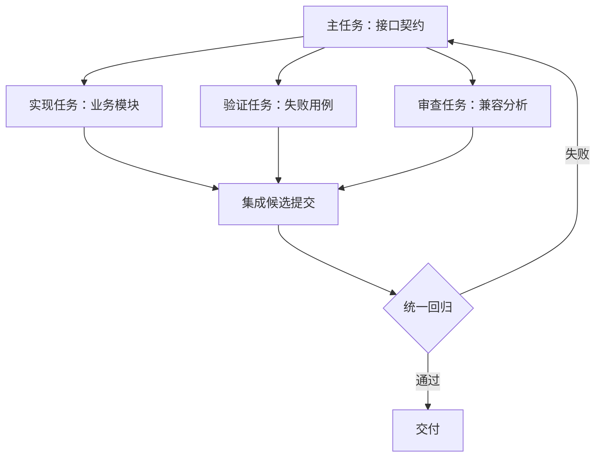

# Skills、MCP、Hooks 与多 Agent

## 先区分四类能力

| 能力 | 核心作用 | 例子 | 不能保证什么 |
| --- | --- | --- | --- |
| Skill | 可复用流程、领域知识和资源 | 数据库迁移评审步骤 | 不自动获得数据库权限 |
| MCP | 接入外部工具与资源的协议 | 读取工单、查询文档 | 不天然保证内容可信或调用安全 |
| Hook | 在宿主生命周期节点执行逻辑 | 格式化、检查、审计 | 可绕开的本地 Hook 不是最终门禁 |
| Subagent | 给有边界的子任务独立上下文 | 检查 API 兼容性 | 多个 Agent 不等于独立正确性证明 |

GitHub 官方文档将自定义指令、MCP、Hooks、Skills 和自定义 Agent 列为不同扩展方式。实际支持情况和权限应按宿主核对。[官方扩展说明](https://docs.github.com/en/copilot/concepts/agents/cloud-agent/about-cloud-agent)

## 用一个数据库迁移任务串起来

主任务维护接口与数据契约；迁移评审 Skill 提供锁表、回填、兼容和回滚检查步骤；只读工具查询测试环境表结构；Hook 可以做格式检查；独立审查任务检查旧版本兼容性；CI 使用固定提交执行迁移与回归。

身份认证和授权在服务端执行。不要通过“请勿访问生产库”的自然语言规则替代账号权限，也不要把可写生产凭据下发给只需查文档的工具。

## 并行如何避免互相覆盖

只有契约已明确、工作可分离的任务才适合并行。规定可写文件、输入版本、预期产物和交接方式；多个任务修改相同接口时，先解决依赖顺序。独立分支或 worktree 隔离文件修改，但不隔离共享数据库、端口、外部副作用和业务语义冲突。

## 工具执行边界

| 操作 | 合适的运行约束 |
| --- | --- |
| 读代码、文档 | 限定仓库和数据范围；外部材料按不可信输入处理 |
| 跑测试 | 隔离环境、固定依赖、超时和资源上限 |
| 创建 PR | 授权仓库、明确基础版本、保留 diff 与日志 |
| 迁移或部署 | 受控身份、环境隔离、发布策略、恢复能力 |

长任务应持久化任务状态和产物引用；超时取消要传播到子进程。取消模型会话不意味着已经发出的外部动作撤销，恢复时先检查动作结果。

## 追问：Skill 越多越好吗

不是。重复或冲突规则增加选择成本，过长流程会阻碍简单任务。只保留能减少已知错误、可版本管理且有负责人维护的流程；先用固定任务集比较质量和总耗时，再决定保留。按需加载也不能替代权限控制。

## 追问：多个模型互审能发现全部问题吗

不能。它们可能共享相同错误假设或训练偏差。审查要绑定确定的提交，要求给出具体路径、触发条件和反例，再用执行证据确认。最终门禁应包含可重复测试和人的业务判断。

## 延伸阅读

[Tools、MCP 与 A2A](../ai-agent/04-tools-mcp-a2a.md)；[Multi-Agent](../ai-agent/08-multi-agent.md)。
