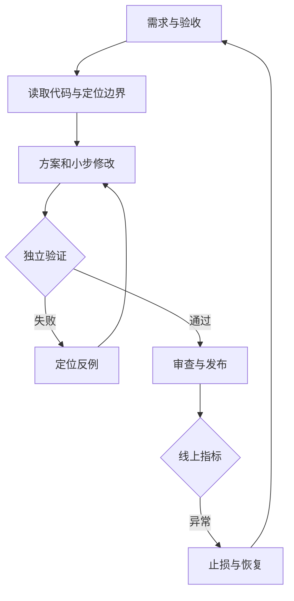

# 工具选型与 AI Coding 开发闭环

## 先按任务选择交互方式

| 方式 | 合适场景 | 主要成本 | 验收重点 |
| --- | --- | --- | --- |
| IDE 内补全与对话 | 局部修改、读调用链、即时调试 | 人持续参与，容易漏跨模块影响 | 实际 diff 和调用方 |
| CLI 编程 Agent | 批量修改、构建排障、跨文件任务 | 命令权限、环境依赖、长任务状态 | 命令日志、范围和终止条件 |
| 云端异步 Agent | 独立缺陷、后台实现、PR 协作 | 环境准备、排队、上下文传递 | 基础提交、可复现环境、PR 证据 |

Claude Code、Codex、Cursor、Copilot 等产品可能覆盖多种形态。选型时实际检查仓库读取、文件修改、命令执行、联网和提交权限，不通过工具名称推断能力。GitHub 的云端 Agent 和 IDE Agent 模式执行环境不同，接手任务前应核对分支和环境。[GitHub 官方说明](https://docs.github.com/en/copilot/concepts/agents/cloud-agent/about-cloud-agent)

## 从需求到交付的闭环



每一步输出可复用证据：需求有输入输出；定位有文件和调用链；实现有 diff；验证有命令、环境和结果；发布有版本、观察窗口及恢复方案。模型说“完成”只能作为待核验的状态报告。

## 一次任务如何拆小

以“优化订单查询”为例，先确定慢在哪里：网络、线程等待、SQL、外部调用还是序列化。第一次只建立基线并定位瓶颈；第二次修改一种原因；第三次检验改动对结果、吞吐和资源占用的影响。

不要把“升级框架、拆微服务、加缓存、重写 DAO”混为一个任务。每个提交应能回答：为什么改、怎样证明、如何撤销。如果必须原子修改接口和调用方，就保留在同一可验证变更中，不为追求小 diff 破坏编译和兼容性。

## 可直接使用的任务模板

```text
目标：修复订单列表查询在大租户下的延迟问题。
先读取：控制器、查询服务、Mapper、表结构、现有测试与执行计划。
业务约束：tenant_id 必须来自认证上下文；排序和分页语义不变。
工作顺序：复现和测量 → 解释瓶颈 → 提出修改 → 验证。
范围：本次只改查询及必要索引，不改公共响应结构。
验收：结果一致；跨租户拒绝；空页和边界页正确；
      在同等数据分布与并发下比较延迟、数据库负载和扫描行数。
交付：列出修改、执行过的命令、结果、未验证项和回滚方式。
```

这是任务说明模板，不能代替实测参数。应填入具体版本、数据规模和可接受阈值。

## 追问：Agent 卡住反复改同一处怎么办

先保存当前 diff、失败日志和已排除假设，判断是环境错误、错误需求还是实现缺陷。缺少 JDK 或网络失败时，不应继续改业务代码。设定尝试次数或时间预算，超过预算后缩小复现范围或由人接手；下一轮只携带相关事实和仍待验证的假设。

## 追问：什么时候不适合全自动执行

业务规则仍不确定、生产数据变更难恢复、跨团队协议无人确认时，应先补决策和验证条件。是否自动执行由任务授权、运行时权限和可恢复性决定；重复询问已授权的小改动也会增加交付成本。
