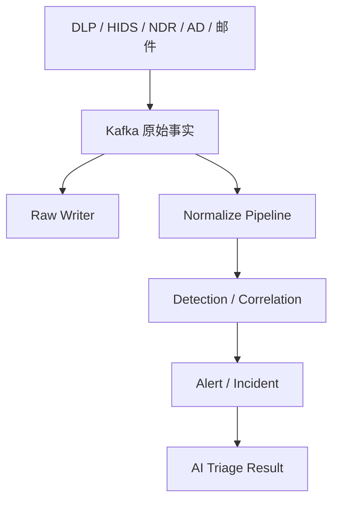

# SOC 事件、告警分层与容量设计

本页记录当前 SOC 项目的数据口径、容量推导和分片设计。通用原理见
[分片、路由与容量](./07-shards-routing-capacity.md)，这里不重复基础定义。

> [!IMPORTANT]
> 每日 800～900 万条、Primary 约 150GB 是候选人提供的项目快照，面试前必须用监控报表再次核验。
> 它不是 Elasticsearch 的通用容量标准，也不是“单个分片 150GB”。

## 先给结论

1. 800～900 万是进入 SOC 链路的 **Event 与 Alert 业务记录总量**，不是 800～900 万条高危告警。
2. 150GB 是相关 Data Stream 每日新增 **Primary Store 的合计**。配置一个副本后，同口径物理存储起点约为 300GB/日。
3. Raw、Normalized、Alert、AI Result 会形成多个 ES 文档，所以 ES 文档数可能大于业务记录数。
4. 分片必须按每个 Data Stream 的数据量、写入峰值、查询模式和恢复目标分别计算，不能把 150GB 机械除成全局固定分片数。
5. 35～40GB 可作为本项目 `max_primary_shard_size` 的压测起点；是否采用，必须由恢复时间、Merge、查询 P99 和节点水位共同验证。

## 90 秒面试回答

> 我们先统一口径：每天 800～900 万是安全事件和告警的业务记录总量，不是告警数量，也不等于最终 ES 文档数。Raw、标准化事件、告警和 AI 研判结果按生命周期与查询模型拆开，相关数据流每天 Primary Store 合计约 150GB；一个副本后约 300GB，这是测得的存储口径，不是单分片大小。
>
> 分片时我不会直接说“150GB 配 4 个 shard”，而是先拿到每条 Data Stream 的 `pri.store.size`、峰值写入、租户分布和查询扇出，再让单主分片落在压测可恢复的区间。高流量流以 `max_primary_shard_size` 35～40GB 作为起点并用 `max_age` 兜底；低流量 Alert 和 AI Result 放宽时间条件，避免每天产生大量小分片。最后用写入延迟、429、Merge backlog、P99、节点水位和单分片恢复时间验收。

## 数据边界：Event、Alert 与 ES Document

### Event 是事实输入

Event 是 DLP、HIDS、NDR/天眼、AD、邮件网关等数据源产生的安全事实。它可以是文件外发、进程启动、网络会话、身份变更或邮件投递。

Event 不等于“需要处置的风险”。它应该尽量保留来源、租户、时间、原始标识和证据，以便重放、审计和重新标准化。

### Alert 是检测结论

Alert 是规则、关联分析或检测模型基于一个或多个 Event 生成的风险信号。常见情况是：

- 多个 Event 聚合成一个 Alert；
- 一个 Event 命中多个规则，产生多个 Alert；
- Alert 经过去重、抑制或升级形成 Incident；
- AI 研判产生新的结果版本，但不应覆盖原始安全事实。

### 四层数据模型

| 数据层 | 主要内容 | 典型写入模式 | 典型查询 | 推荐存储形态 |
|---|---|---|---|---|
| Raw Event | 厂商原始载荷、来源 ID、接收时间 | 只追加、不可变 | 审计、重放、取证 | Data Stream |
| Normalized Event | ECS/统一字段、解析状态、标准化标签 | 只追加或按版本重建 | 检索、关联、聚合 | Data Stream |
| Alert/Incident | 规则命中、风险等级、处置状态引用 | 新增较多，状态可能更新 | 看板、工单、调查 | Data Stream 或 Alias + Write Index |
| AI Result | 模型版本、Prompt 版本、证据、置信度、结论 | 多版本追加，避免原地覆盖 | 研判回溯、评估 | 版本化文档或独立索引 |

Data Stream 适合追加型时间序列数据。若 Alert 需要频繁以同一 `_id` 做 last-write-wins 更新，应评估 Alias + Write Index，或者把状态变化建模为追加事件，而不是强行套用 Data Stream。



## 150GB 与 300GB 怎么解释

### 先区分监控字段

以 `_cat/indices` 为例：

- `pri.store.size`：主分片存储总量；
- `store.size`：主分片和副本分片的存储总量。

在副本数为 1、主副本大致等大的正常状态下：

$$
\text{Physical Store} \approx \text{Primary Store} \times (1 + \text{replicas})
$$

因此项目快照可以换算为：

$$
150\text{GB} \times (1 + 1) \approx 300\text{GB/day}
$$

这个 300GB 仍未包含：

- 磁盘水位需要的空闲空间；
- Rollover 与删除之间的重叠窗口；
- Relocation、恢复和 Reindex 的临时放大；
- 快照仓库容量；
- 数据增长与突发流量余量。

如果热层保留 7 天，仅主副本数据基线约为 2.1TB。再考虑 30% 的工程余量，节点可用磁盘规划不能低于约 2.73TB；实际还要按节点数、分配规则和水位验证，而不是只做集群总量除法。

### 单条大小只能做合理性检查

假设用 850 万条作为中位数：

- 按十进制单位，`150GB / 850万 ≈ 17.6KB`；
- 按二进制单位，`150GiB / 850万 ≈ 18.9KiB`。

这不是原始 Event 的平均 Payload，因为 Primary Store 已包含 `_source`、倒排索引、Doc Values、Stored Fields、编码和压缩，而且一条业务记录可能派生多个文档。它只能帮助发现口径错误，例如把 150GB 误说成某一个 Raw 流或某一个分片。

## 分片数为什么要按 Data Stream 算

对数据流 $i$，先计算三个下界：

$$
P_i \ge \max\left(
\left\lceil \frac{D_i}{S_{target}} \right\rceil,
P_{write},
P_{recovery}
\right)
$$

其中：

- $D_i$：该流一个 Rollover 周期内的 Primary Store；
- $S_{target}$：压测允许的目标主分片大小；
- $P_{write}$：满足峰值写入并行度所需的主分片数；
- $P_{recovery}$：满足故障恢复时间目标所需的主分片数。

然后再用查询扇出和分片管理成本限制上界。分片太少会让单分片恢复、Merge 和热点风险变大；分片太多会增加 Cluster State、Heap、文件句柄和协调开销。

### 150GB 除以 4 的正确说法

如果 **假设** 150GB 全部落在同一个 24 小时 Backing Index：

$$
150\text{GB} / 4 = 37.5\text{GB per primary shard}
$$

这说明 4 个 Primary 在容量维度可能是合理候选，但它不是生产结论，因为实际数据已经按 Raw、Normalized、Alert 和 AI Result 拆流。生产上应对每个流分别计算，再用压测确认。

### 一张可落地的输入表

| Data Stream | 每日 Primary | 峰值 EPS | 最大租户占比 | 查询时间窗 | 目标恢复时间 | 初始 Primary |
|---|---:|---:|---:|---|---|---:|
| Raw DLP | 待实测 | 待实测 | 待实测 | 取证为主 | 待定义 | 计算后给出 |
| Normalized HIDS | 待实测 | 待实测 | 待实测 | 24h/7d | 待定义 | 计算后给出 |
| Alert | 待实测 | 待实测 | 待实测 | 实时看板 | 待定义 | 计算后给出 |
| AI Result | 待实测 | 待实测 | 待实测 | 单告警追溯 | 待定义 | 计算后给出 |

面试时这张表比背一个“4 shard”更能证明做过容量设计。

## Rollover：大小主导，时间兜底

Elastic 官方文档把 `max_primary_shard_size` 定义为：任意主分片达到条件即可触发 Rollover。Elastic 的通用经验是很多场景下 10～50GB 的分片工作良好，但更大或更小都可能适合特定负载。因此本项目的 35～40GB 只是位于该经验区间内的压测起点。

```json
PUT _ilm/policy/soc-high-volume
{
  "policy": {
    "phases": {
      "hot": {
        "actions": {
          "rollover": {
            "max_primary_shard_size": "40gb",
            "max_age": "24h"
          }
        }
      }
    }
  }
}
```

这段配置不是所有流共用的最终值：

- Raw/Normalized 高流量流可以用大小主导、24 小时兜底；
- Alert/AI Result 如果流量低，应放宽 `max_age` 或单独建策略，避免每天生成几百 MB 的小分片；
- 突发流量下应让大小条件提前 Rollover，避免等到固定日期；
- Rollover 后的 Warm/Cold/Frozen、Shrink 和 Force Merge 要由查询与恢复目标决定，不是固定套餐。

## Raw 与 Normalize 双流水线

### 不要把双写误认为原子事务

ES 两次写入不存在跨索引 ACID 事务。正确目标不是让 Raw 和 Normalized 在同一毫秒同时成功，而是：

1. Kafka 保留可重放的原始事实；
2. 两条流水线使用不同 Consumer Group，各自消费完整事件流；
3. 使用稳定 `event_id` 和 `tenant_id` 做幂等写入；
4. 失败进入可观测的重试或 DLQ；
5. 对账任务能发现 Raw 有而 Normalized 无的缺口并重放。

同一个 Consumer Group 会在实例间分摊消息，不会把每条消息广播给 Raw 与 Normalize 两条业务流水线。用于 Fan-out 时，两个业务消费者必须使用不同 Group ID。

### Logstash 多 Pipeline 示例

```yaml
# pipelines.yml
- pipeline.id: soc-raw
  path.config: /etc/logstash/conf.d/soc-raw.conf
  queue.type: persisted

- pipeline.id: soc-normalized
  path.config: /etc/logstash/conf.d/soc-normalized.conf
  queue.type: persisted
```

Raw Pipeline 只做信封校验，不改写原始载荷：

```ruby
input {
  kafka {
    topics => ["soc-events-v1"]
    group_id => "soc-raw-writer-v1"
    codec => json
  }
}

filter {
  if ![event_id] or ![tenant_id] {
    mutate { add_tag => ["invalid_envelope"] }
  }
}

output {
  if "invalid_envelope" in [tags] {
    kafka { topic_id => "soc-events-invalid-v1" codec => json }
  } else {
    elasticsearch {
      data_stream => true
      data_stream_type => "logs"
      data_stream_dataset => "soc.raw"
      data_stream_namespace => "%{[tenant_id]}"
      document_id => "%{[event_id]}"
    }
  }
}
```

Normalize Pipeline 负责字段收敛、解析状态和版本：

```ruby
input {
  kafka {
    topics => ["soc-events-v1"]
    group_id => "soc-normalizer-v3"
    codec => json
  }
}

filter {
  mutate {
    add_field => {
      "[event][id]" => "%{[event_id]}"
      "[labels][normalizer_version]" => "v3"
    }
  }
  date { match => ["event_time", "ISO8601"] target => "@timestamp" }
}

output {
  if "_dateparsefailure" in [tags] {
    kafka { topic_id => "soc-normalize-dlq-v3" codec => json }
  } else {
    elasticsearch {
      data_stream => true
      data_stream_type => "logs"
      data_stream_dataset => "soc.normalized"
      data_stream_namespace => "%{[tenant_id]}"
      document_id => "%{[event_id]}"
    }
  }
}
```

生产上还要补齐认证、TLS、Schema 校验、敏感字段处理、重试上限、DLQ 保留期和 Pipeline 指标。配置只是解释职责边界，不能代替压测。

## 大租户与热点

多租户不能只有“每租户一个索引”和“所有租户共用一个索引”两个极端。推荐分层：

1. 普通租户共享 Data Stream，用默认路由分散写入；
2. 查询要求单租户隔离时，可评估受控 Routing，但必须避免一个大租户被固定到单分片；
3. 超大租户只有在容量、隔离或合规收益明确时才独立流；
4. 从共享流迁出要有 Alias、Reindex、校验和回滚方案。

判断热点必须同时看：分片写入率、节点 CPU、Merge、磁盘吞吐、线程池队列、429、单租户占比和 Query Fan-out，不能只看节点磁盘是否均匀。

## 容量验收与反证

### 压测矩阵

| 维度 | 至少覆盖 |
|---|---|
| 写入 | 平均、2 倍峰值、突发、单租户倾斜、字段变宽 |
| 查询 | 实时看板、单事件取证、聚合、跨日搜索、并发导出 |
| 故障 | 单节点下线、Replica Recovery、磁盘水位、网络抖动 |
| 生命周期 | Rollover、迁移、删除、快照、恢复、Reindex |
| 验收 | P95/P99、429、Indexing Latency、Merge、Heap、恢复时间 |

### 必须能推翻自己的设计

如果出现以下任一情况，就不能宣称当前分片数已经合适：

- 单分片恢复超过 RTO；
- 高峰期持续出现 429 或 Merge backlog；
- P99 随跨分片查询明显恶化；
- 大量 Backing Index 长期小于 10GB；
- 一个租户长期占据单分片大部分 CPU/写入；
- 水位余量不足以完成 Relocation 或 Reindex。

## 事实核验清单

面试前从监控或生产报表确认：

- 800～900 万的统计对象、去重规则和时间窗口；
- Raw、Normalized、Alert、AI Result 各自的文档数和 `pri.store.size`；
- Replica 数、热层保留天数和快照口径；
- 峰值 EPS、Bulk 大小、Worker 数和 429 比例；
- 当前每个 Data Stream 的 Primary 数、Rollover 条件和分片 P50/P95；
- 最大租户占比、典型查询时间窗和搜索 P99；
- 单分片恢复时间与集群 RPO/RTO。

## 官方资料

- [Elastic：Size your shards](https://www.elastic.co/docs/deploy-manage/production-guidance/optimize-performance/size-shards)
- [Elastic：Data streams](https://www.elastic.co/docs/manage-data/data-store/data-streams)
- [Elastic：Rollover API](https://www.elastic.co/docs/api/doc/elasticsearch/operation/operation-indices-rollover)
- [Elastic：使用 Data Stream 管理时序数据](https://www.elastic.co/docs/manage-data/lifecycle/index-lifecycle-management/tutorial-time-series-with-data-streams)

下一步继续阅读 [SOC Elasticsearch P8 压力面试](./18-soc-pressure-interview.md)。
