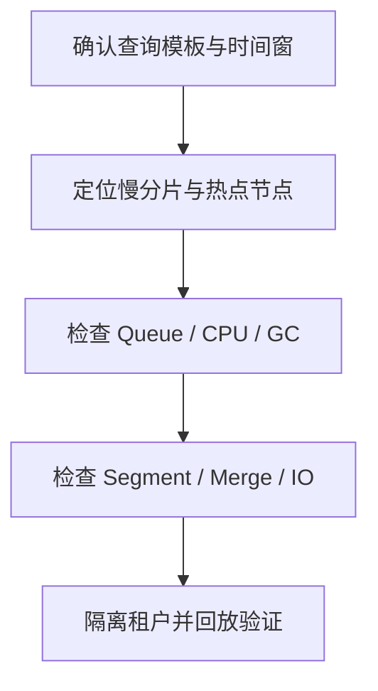
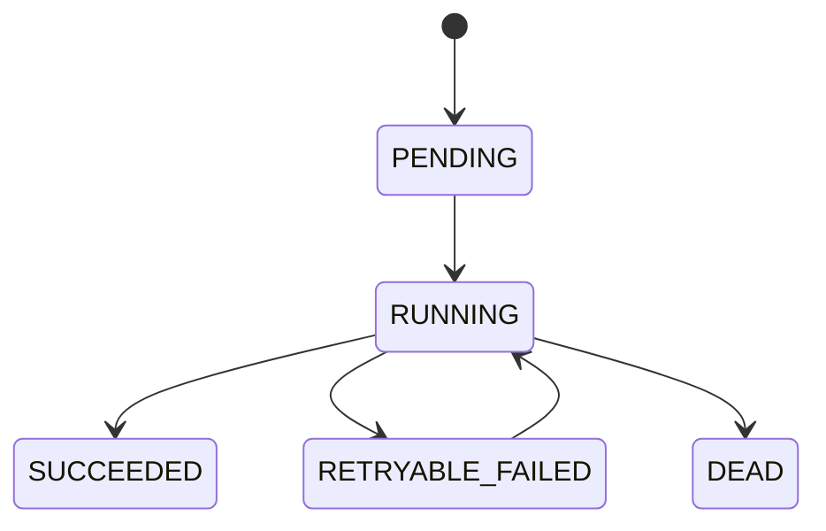

# SOC Elasticsearch P8 压力面试

本页把通用 Elasticsearch 原理映射到 SOC 事件与告警生产场景。容量事实与数据分层先看
[SOC 事件、告警分层与容量设计](./17-soc-event-alert-capacity.md)。

## P8 回答方法：结论、判断、处置、验证

生产题不能只报参数。统一用四段式：

1. **结论**：先说系统边界与当前判断。
2. **判断**：拿哪些指标区分根因，不凭经验拍参数。
3. **处置**：先止血，再修复，再治理。
4. **验证**：用什么指标、压测或故障演练证明恢复。

例如面试官问“为什么 4 个 Primary”：

> 4 个只能是某个 150GB 单流假设下的容量候选，不能代表所有 SOC 流。我会先按 Data Stream 拆出每日 Primary、峰值 EPS、最大租户占比和恢复目标，再用单分片 35～40GB 作为起始值推导；随后用 Merge、429、P99 和恢复时间压测。如果查询扇出变差或恢复超时，我会调整分片或 Rollover，而不是把 4 写成固定最佳实践。

## 搜索链路：慢在哪里

### Query Phase

协调节点选择每个目标主分片组中的一个副本，把查询发给这些分片。每个分片在本地完成查询、打分和 Top N 排序，只返回 Doc ID、Score 或 Sort Values。

### Reduce 与 Fetch Phase

协调节点合并各分片候选结果，得到全局 Top N，再向命中文档所在分片获取 `_source` 或 Stored Fields。P8 级回答要主动指出三个放大器：

- 目标分片越多，Fan-out、队列等待和尾延迟越明显；
- `from + size` 越大，每个分片保留的候选越多，协调节点归并成本越高；
- Fetch 返回大 `_source`、高亮或脚本字段时，磁盘与网络成本可能超过 Query。

### SOC P99 突增的定位顺序



先对比同一 Query Template 的 P50/P95/P99，再看慢日志、`_tasks`、线程池队列、节点 CPU/GC、磁盘延迟和每个 Shard 的耗时。不能一看到 P99 高就直接扩容；如果只有一个租户、一个时间窗或一个分片慢，横向加节点未必解决热点。

通用搜索过程见 [查询链路](./05-search-path.md)。

## Routing：少查分片不等于一定更快

Routing 的收益是缩小查询分片集合，代价是写入分布被业务 Key 约束。

### 适合的条件

- 大多数查询都携带稳定的 `tenant_id`；
- 单租户数据量和峰值受控；
- Routing Key 与授权过滤绑定，服务端不会相信客户端任意传值；
- 已验证迁租户、扩容和 Reindex 的路径。

### 最危险的误用

如果直接用超大租户 ID 作为 Routing，一个大租户的数据会长期压在单个主分片上。即使集群还有很多空闲节点，该分片的 CPU、Merge 和写入队列仍可能打满。

处理优先级：

1. 查询层限制无边界时间窗和高代价 DSL；
2. 对热点租户使用受控的 Bucketed Routing，例如 `tenant_id + bucket`；
3. 读请求同时查该租户的有限 Bucket 并归并；
4. 只有隔离收益超过迁移成本时，才把超大租户迁到独立 Data Stream。

## Merge 为什么同时影响写入与查询

Refresh 产生新的 Segment；Segment 数增多后，Lucene 后台 Merge 把小 Segment 合并为大 Segment，并清理已删除文档。Merge 会消耗磁盘吞吐、CPU 和文件句柄，还可能与查询竞争 Page Cache。

| 现象 | 需要验证的证据 | 不应先做的事 |
|---|---|---|
| Indexing Latency 上升 | Merge Time、Throttle Time、磁盘延迟 | 直接把 Worker 翻倍 |
| 查询 P99 抖动 | 慢分片、Segment 数、Cache Miss | 只调查询超时 |
| 磁盘快速增长 | Delete Ratio、Merge backlog、Rollover | 对热索引 Force Merge |
| 节点冷热不均 | 每分片写入、租户倾斜、Allocation | 只看节点总磁盘 |

治理顺序是降低入口压力、延长合理的 Refresh、修正 Bulk 和分片/Rollover，再评估硬件与节点。Force Merge 只适用于不再写入的只读索引，并且要验证资源窗口与快照影响。

## Bulk 与 429：只重试失败 Item

Bulk API 的 HTTP 成功不代表每个 Item 成功，必须检查响应中的 `errors` 和每个 Item 的状态。HTTP 429 表示集群正在 Push Back；可以重试，但应使用指数退避并限制次数，不能无限塞入更大的本地队列。

```java
for (BulkItemResult item : response.items()) {
    if (item.succeeded()) {
        checkpoint.markDone(item.eventId());
    } else if (item.status() == 429 || item.status() >= 500) {
        retryQueue.offer(item.event(), exponentialBackoff(item.attempt()));
    } else {
        deadLetterQueue.offer(item.event(), item.errorReason());
    }
}
```

生产实现还要满足：

- `event_id` 保证重试幂等；
- 退避增加随机抖动，避免所有 Worker 同时重试；
- 队列有容量上限，满时向 Kafka 消费端施加背压；
- Mapping 冲突等不可重试错误直接 DLQ；
- 对 429 比例、重试次数、最大积压年龄和端到端延迟告警。

如果 429 持续存在，优先定位热点、Merge、磁盘、Refresh、Bulk 大小和集群容量。把写线程池队列调大只会推迟失败并增加堆内存、超时和尾延迟。

Elastic 的 [Rejected requests](https://www.elastic.co/docs/troubleshoot/elasticsearch/rejected-requests) 明确建议对 429 使用退避，避免进一步放大压力。

## Refresh、Flush、Translog 与 Merge

| 机制 | 解决的问题 | 是否让文档可搜索 | 关键风险 |
|---|---|---:|---|
| Refresh | 打开新的 Searcher，发布新 Segment | 是 | 太频繁会产生更多小 Segment |
| Translog fsync | 在 Lucene Commit 前提供崩溃恢复 | 否 | 异步持久化会扩大故障窗口 |
| Flush | Lucene Commit，并开始新的 Translog Generation | 间接 | 不是普通可见性的控制按钮 |
| Merge | 合并 Segment、清理删除标记 | 已有文档仍可查 | IO/CPU 与查询、写入竞争 |

“写成功但马上搜不到”通常先看 Refresh 语义，而不是 Flush。需要 read-after-write 时优先评估业务回源、按 ID Get 或 `refresh=wait_for` 的局部使用，不能把全局 `refresh_interval` 改成极小值解决所有一致性问题。

## 深分页、导出与聚合

### 在线翻页

- 浅分页可用 `from/size`，但必须限制窗口；
- 稳定深分页使用 PIT + `search_after`，Sort 中包含唯一 Tie-breaker；
- Scroll 更适合批处理，不作为实时用户翻页方案。

### 500 万条导出

不要让 HTTP 请求同步等待全量结果。创建导出任务，固定 PIT/查询快照语义，后台分批读取，流式写入对象存储，记录进度与过期时间，并限制每租户并发。导出链路与在线搜索隔离，必要时使用独立协调/工作节点和限速。

### 高基数聚合

先确认需求是否真的需要精确全量聚合。常用治理：

- 缩小时间窗和过滤范围；
- 对 Dashboard 预聚合或 Transform；
- 使用 Composite Aggregation 分页遍历 Bucket；
- 对 Cardinality 接受可解释的近似；
- 避免在 `text`、脚本字段和无界高基数字段上直接聚合。

## 生命周期、故障与重建

### Yellow/Red 不是同一种事故

- Yellow：主分片可用但至少一个副本未分配，通常仍可读写，但容灾能力下降；
- Red：至少一个主分片不可用，必须先确认受影响索引和数据恢复来源。

统一排查：Cluster Health → Unassigned Reason → Allocation Explain → 节点/磁盘/水位 → 恢复与快照。不要先执行强制分配过期 Primary，否则可能把新数据覆盖为旧副本。

### 零停机重建

Mapping、Analyzer 或主分片数不能原地安全修改时：

1. 新建版本化 Index Template 和目标索引/Data Stream；
2. 从 Kafka 事实流或源索引 Reindex 历史数据；
3. 增量追平写入并记录高水位；
4. 校验文档数、业务抽样、聚合、Checksum 和查询差异；
5. Alias 原子切换；
6. 保留旧索引回滚窗口，再按变更流程删除。

如果业务代码同时双写新旧索引，必须明确部分成功、重试和幂等设计；优先使用可重放的 CDC/Kafka 事实流，降低应用双写耦合。

## DB 与 ES 的事实边界

| 数据 | 建议事实源 | ES 的角色 |
|---|---|---|
| 当前工单状态、审批、人工处置 | 事务数据库 | 搜索投影 |
| 原始安全事实 | Kafka/对象存储/Raw Index，按审计要求确定 | 检索与取证 |
| 历史事件与告警 | ES/Data Stream | 时序检索、聚合 |
| AI 研判结果 | 业务状态库或结果账本 | 可搜索结果与证据索引 |
| Prompt/模型/规则版本 | 配置与版本仓库 | 查询维度 |

ES 不适合承载强一致余额、库存或唯一审批状态。它可以是安全事件的检索事实库，但“谁是最终事实源”必须按数据类型定义，不能一句“都放 ES”回答。

## AI 研判结果的一致性

远程模型调用不能被数据库或 ES 事务回滚。建议把它建模成可恢复状态机：



稳定幂等键可以使用：

```text
analysis_key = event_id + model_version + prompt_version + evidence_version
```

写入结果时：

- 同一个 `analysis_key` 只接受一个成功结果或保存明确版本；
- 保存证据 ID、检索版本、模型版本、Token/耗时和置信度；
- ES 写失败只重试“结果投影”，不重复调用已经成功的模型；
- 状态流转用乐观并发控制，避免两个 Worker 同时覆盖；
- 毒任务进入人工/死信队列，不能无限消耗模型预算。

## Hybrid Search 中 ES 承担什么

SOC Agent 的在线告警通常不需要先切成知识 Chunk；它是查询条件和实时证据。知识库至少分两类：

1. 制度/SOP/ATT&CK/产品文档；
2. 历史真实攻击、误报与处置工单。

ES 可以同时承担：

- Metadata/租户/权限过滤；
- BM25 关键词召回；
- `dense_vector` 的近似 kNN 召回；
- RRF 或应用层融合；
- 按知识类型配额、去重和时间衰减前的候选检索。

Rerank、上下文装配和最终判断通常在 Agent/RAG 服务完成。实时事件索引和知识索引要分开，避免把大量原始 Event 全部向量化。

## 五轮压力面

### 压力面一：150GB 是一个分片吗

**问：** 150GB Primary 为什么不直接建 4 个分片？

**答：** 150GB 是多个数据流主分片存储之和。只有假设单流时，除以 4 才是 37.5GB；生产要按每个流分别计算，并用峰值、查询扇出和恢复时间验收。

**追问：** 4 个还是 5 个？

**答：** 先给候选区间，不凭口述定最终值。对每个流跑 4/5 个 Primary 的同数据集对照，比较写入 P99、429、Merge、查询 P99、恢复时间和 Cluster State 成本。

### 压力面二：大租户独立索引是不是粗暴

**问：** 大租户一热点就拆索引，索引不会爆炸吗？

**答：** 独立索引是分层治理的最后一步。先限制查询、验证 Routing Key、使用有限 Bucket，再按租户体量、SLA、合规和运维成本决定迁出，并设准入/退出阈值。

### 压力面三：P99 从 500ms 到 8s

**问：** 你先看什么？

**答：** 先固定 Query Template、时间窗和租户，确认是全局还是单分片；然后看慢日志、任务、队列、CPU/GC、磁盘和 Merge。全局容量问题与单租户热点的处置完全不同。

### 压力面四：出现 429 为什么不调大队列

**问：** 队列大一点不就能扛过去？

**答：** 大队列只是把拒绝改成更长等待，会增加 Heap、超时和重试风暴。应 item 级幂等重试、指数退避和入口背压，同时定位热点、Merge、磁盘或容量根因。

### 压力面五：模型成功、ES 失败怎么回滚

**问：** AI 调用已经付费成功，ES 写失败，事务怎么回滚？

**答：** 远程副作用无法由本地事务回滚。用状态机与 `analysis_key` 保存调用结果或调用凭证，ES 失败只重试结果投影，不再次调用模型；最终用对账任务收敛。

## 生产命令顺序

```bash
GET _cluster/health?level=indices
GET _cat/indices?v&s=pri.store.size:desc
GET _cat/shards?v&s=store:desc
GET _cat/thread_pool/write,search?v
GET _nodes/hot_threads
GET _nodes/stats/indices,os,jvm,thread_pool,fs
GET _tasks?detailed=true&actions=*search*,*bulk*,*reindex*
GET _cluster/allocation/explain
```

命令必须带着问题执行：先确认影响范围，再定位节点/分片和资源，最后验证处置效果。不要把命令清单当成排障结论。

## 面试前事实核验

- 800～900 万究竟包含哪些数据层，统计是否去重；
- 150GB 是 `pri.store.size` 的哪些 Data Stream 合计；
- 当前副本数、热层天数、峰值 EPS 与 Bulk 参数；
- 搜索 P50/P95/P99、429 和 Merge 指标；
- AI 模型、Prompt、Evidence 的真实版本键；
- Hybrid Search 当前是否已经上线，还是设计方案。

没有生产证据的数据要明确说“候选人提供，面试前核验”或“设计方案，尚未上线”，这比编造精确数字更符合 P8 的可信度要求。

## 延伸阅读

- [分片、路由与容量](./07-shards-routing-capacity.md)
- [查询链路](./05-search-path.md)
- [生产故障手册](./10-production-runbook.md)
- [重建索引与一致性](./12-reindex-consistency.md)
- [SOC RAG 项目深挖](../system-design/soc-agent.md)
