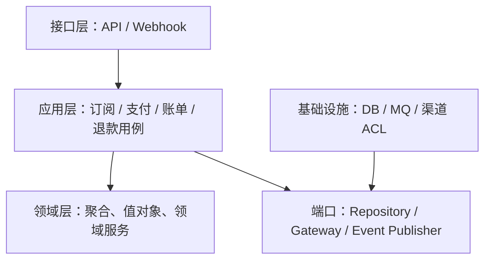

# 订阅系统限界上下文与整体架构

## 架构原则

业务规则只进入领域层，应用层编排用例，接口层承接 API/Webhook，基础设施层实现仓储、消息与外部支付适配。外部渠道语言停留在防腐层。

## 限界上下文

| 上下文 | 核心职责 | 关键边界 |
|---|---|---|
| Subscription | 生命周期、周期、续费、取消、宽限期 | 不表达渠道支付细节 |
| Payment | 支付单、尝试、状态和渠道结果 | 不直接激活订阅 |
| Billing | 账单、应收、实收和对账 | 账单不等于支付尝试 |
| Refund | 独立退款生命周期 | 支持部分、多次和异步结果 |
| Agreement | 自动续费授权 | 与普通支付指令分离 |

User、Notification、Risk、Finance 等是协作或支撑上下文；上下文之间通过稳定契约交互。
