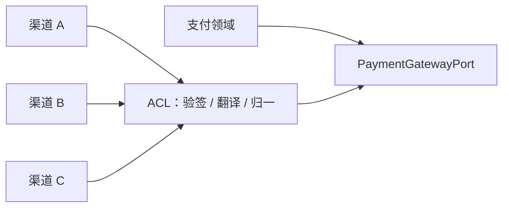

# 支付渠道防腐层

## 防腐职责

1. 验签、解密与来源校验。
2. 渠道报文解析与审计留存。
3. 渠道状态映射为统一的 PaymentStatus。
4. 元、分、cents 和币种精度归一为 Money。
5. 错误码翻译为可重试、待查询、明确失败等领域语义。
6. 提取幂等键、渠道流水并描述渠道能力。

trade_status、result_code、prepay_id、transaction_id、PaymentIntent 等外部字段只能进入适配器或审计记录，不能成为核心聚合的语言。
