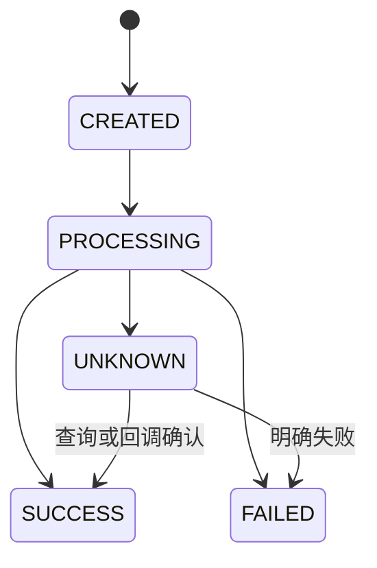

# 订阅支付状态机

## 状态与不变量

```mermaid
stateDiagram-v2
  [*] --> CREATED
  CREATED --> PROCESSING
  PROCESSING --> SUCCESS
  PROCESSING --> FAILED
  PROCESSING --> UNKNOWN
  UNKNOWN --> SUCCESS: 查询或回调确认
  UNKNOWN --> FAILED: 明确失败
```

- SUCCESS 不因迟到失败通知而回退。
- 同一渠道流水唯一，重复回调幂等。
- 回调先验签，再校验商户、订单、金额、币种和渠道流水。
- 同步返回、查询与回调并发时，通过版本、条件更新和状态优先级裁决。
- UNKNOWN 不能盲目重试扣款，必须由查询、回调、对账和人工补偿收敛。
