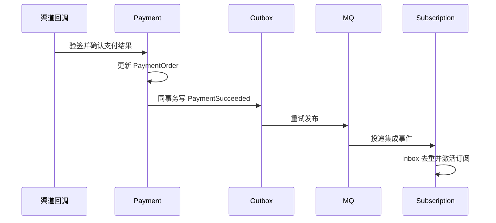

# Outbox、Inbox 与最终一致性

## 支付成功链路

```mermaid
sequenceDiagram
  participant C as 渠道回调
  participant P as Payment
  participant O as Outbox
  participant M as MQ
  participant S as Subscription
  C->>P: 验签并确认支付结果
  P->>P: 更新 PaymentOrder
  P->>O: 同事务写 PaymentSucceeded
  O->>M: 重试发布
  M->>S: 投递集成事件
  S->>S: Inbox 去重并激活订阅
```

后台 Relay 负责可重试发布；消费者写 Inbox 或使用等价的业务幂等条件。失败进入分级重试、死信和人工补偿，最终由对账验证外部资金事实与内部状态是否一致。
