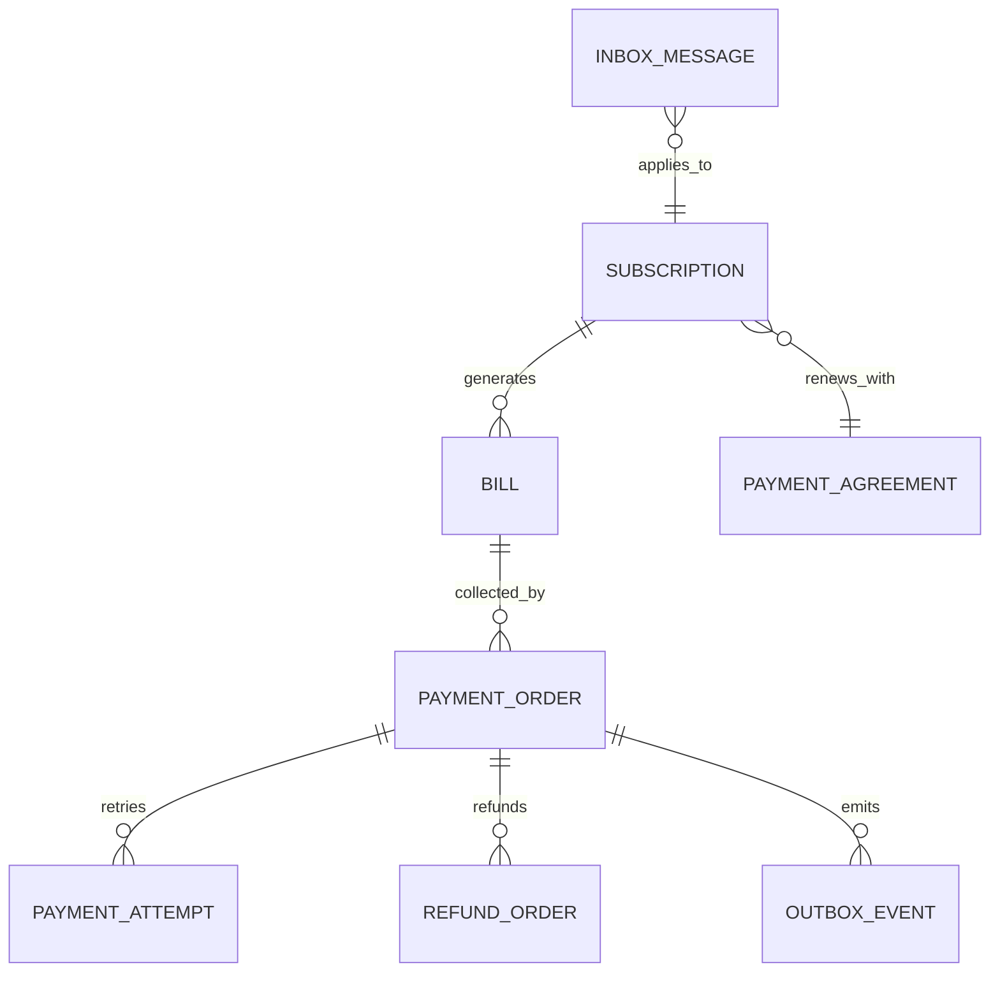

# 订阅支付核心数据模型

## 核心实体关系

## 建模检查点

- 金额使用带币种与舍入规则的 Money/Decimal，不用浮点数。
- PaymentOrder、Bill 和 Subscription 分别拥有状态与版本字段。
- channelTxnId、幂等键、事件 ID、消费消息 ID 建立适当唯一约束。
- 原始渠道报文进入受控审计存储，敏感字段最小化并设置保留策略。
- 表结构只是聚合持久化方式，不能反向决定不合理的聚合边界。
