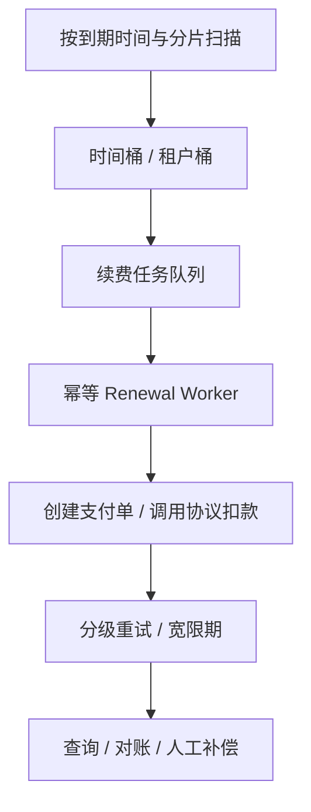

# 大规模订阅续费调度

## 调度链路

```mermaid
flowchart TB
  SCAN["按到期时间与分片扫描"] --> BUCKET["时间桶 / 租户桶"]
  BUCKET --> MQ["续费任务队列"]
  MQ --> WORKER["幂等 Renewal Worker"]
  WORKER --> PAYMENT["创建支付单 / 调用协议扣款"]
  PAYMENT --> RETRY["分级重试 / 宽限期"]
  RETRY --> RECON["查询 / 对账 / 人工补偿"]
```

## 关键约束

- 调度键由订阅、账期和动作组成，重复扫描不会重复扣款。
- 分桶和队列只负责削峰，真实并发度由渠道配额、数据库容量和 SLO 决定。
- 明确失败按策略重试；未知结果先查询，不直接再次扣款。
- 宽限期、暂停权益、通知和最终取消属于订阅策略，不由支付渠道决定。
- 每批任务可追踪、可暂停、可重放，并与账单、支付、渠道流水对账。
