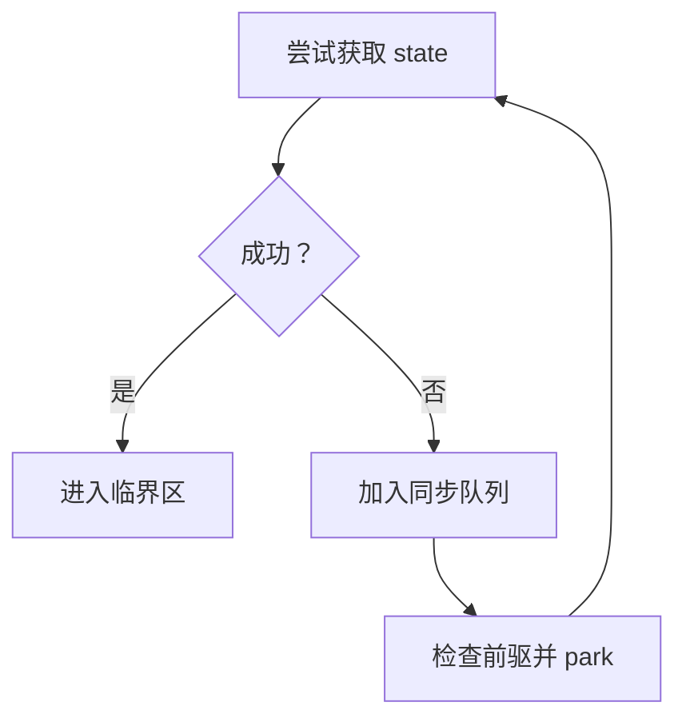

# synchronized、CAS、AQS 与并发工具

本页合并源资料中的 `synchronized`、CAS、`ReentrantLock`、AQS 和 JUC
同步器，删除重复问答并修正旧版本结论。JMM 语义见
[JMM、volatile 与 ThreadLocal](./jmm-volatile-threadlocal.md)，线程池见
[线程池生产实践](./thread-pool-production-guide.md)。

## 90 秒面试回答

> `synchronized` 同时提供互斥与内存可见性。同步代码块由
> `monitorenter`/`monitorexit` 指令表达；同步方法则由方法的
> `ACC_SYNCHRONIZED` 标志表达，不能把两者都回答成相同字节码。
> 实例同步方法锁 `this`，静态同步方法锁对应的 `Class` 对象，代码块锁显式表达式的结果。
>
> `ReentrantLock` 基于 AQS 构建，AQS 用一个同步状态、独占/共享获取协议和
> FIFO 等待队列把“资源获取失败后的排队、阻塞、唤醒”抽象出来；每个
> `Condition` 还有独立条件队列，`signal` 只是把节点转移到同步队列，线程仍须重新竞争锁。
>
> CAS 适合无锁状态转换，但失败重试会消耗 CPU，且当中间状态有业务意义时要处理 ABA。
> P8 选型不背“谁一定更快”，而是先看正确性语义、可中断/超时/条件队列需求、竞争度和故障证据，再用 JFR/JMH 验证。

## synchronized 的准确语义

### 同步块与同步方法不是一种字节码形态

| 写法 | class 文件表达 | Monitor 对象 |
|---|---|---|
| `synchronized (lock) {}` | `monitorenter` 与正常/异常路径上的 `monitorexit` | 表达式 `lock` 的结果 |
| 实例 `synchronized` 方法 | 方法标记 `ACC_SYNCHRONIZED` | 接收者 `this` |
| `static synchronized` 方法 | 方法标记 `ACC_SYNCHRONIZED` | 方法所属的 `Class` 对象 |

JVM 调用同步方法时隐式进入/退出 Monitor。异常退出也必须释放 Monitor；源码反编译时常见多个
`monitorexit`，是编译器为正常与异常控制流生成的释放路径。

下面三把锁彼此不同，不能笼统说“一个对象中所有同步方法都会互相阻塞”：

```java
final class Inventory {
    private final Object refreshLock = new Object();

    synchronized void update() {          // 锁 this
    }

    static synchronized void rebuild() {  // 锁 Inventory.class
    }

    void refresh() {
        synchronized (refreshLock) {       // 锁 refreshLock
        }
    }
}
```

只有竞争同一个 Monitor 的临界区才互斥。非同步方法仍可运行；实例锁与类锁也不天然互斥。

### 可重入、可见性与公平性

- **可重入**：持有某个 Monitor 的线程可再次进入同一 Monitor，退出次数与进入次数匹配后才完全释放。
- **可见性**：对某个 Monitor 的解锁 happens-before 后续对同一 Monitor 的加锁。
- **公平性**：Java 语言规范没有给 `synchronized` 公平排队承诺，不能依赖先等待者先获得锁。
- **中断**：等待进入 `synchronized` 的线程不能通过 `interrupt()` 取消这次 Monitor 获取；已经在
  `Object.wait()` 中等待则可以被中断。

“非公平”描述的是没有 FIFO 服务保证，不等于每次都故意插队，也不能由此推导必然饥饿。

### 锁实现是 JVM 细节，不是语言承诺

源资料把“偏向锁 → 轻量级锁 → 重量级锁”当成现代 JDK 的固定默认路径，这只适合解释历史 HotSpot：

| 基线 | 应如何回答 |
|---|---|
| JDK 6–14 的 HotSpot | 可用偏向、栈上 Lock Record、自旋和膨胀等历史实现帮助理解优化演进 |
| JDK 15 | JEP 374 默认禁用并弃用偏向锁及相关选项 |
| JDK 18 以后 | OpenJDK 已将偏向锁机制 obsolete；JDK 21/25 面试不应再说“无竞争默认使用偏向锁” |

对象头、Mark Word、自旋和 Monitor 膨胀属于具体 JVM 实现，可能随版本、GC 和对象头方案变化。
语言层稳定契约只有互斥、可重入和 JMM 同步关系。

锁消除、锁粗化同样是 JIT 可能执行的优化：逃逸分析证明对象不共享时可以消除锁，连续反复锁同一对象时可能扩大临界区。它们不是业务代码可以依赖的保证，也不意味着开发者可以随意扩大锁范围。

### 不要背“synchronized 一定慢”

以下判断都缺少成立条件：

- “`synchronized` 每次都会发生用户态/内核态切换”；
- “竞争稍高就一定比 `ReentrantLock` 慢几十倍”；
- “CAS 永远比互斥锁快”；
- “锁升级后一定不会降级”。

现代 JVM 会自旋、消除、粗化或膨胀锁，结果取决于临界区长度、竞争、核心数、NUMA、JDK 和工作负载。微基准必须用 JMH 做预热、分叉和黑洞处理；生产选择优先看语义和可维护性。

## ReentrantLock 何时值得使用

`ReentrantLock` 与 `synchronized` 都提供相同的基本 Monitor 内存同步效果。它的主要价值不是“性能更强”，而是额外控制能力：

| 需求 | `synchronized` | `ReentrantLock` |
|---|---|---|
| 结构化加解锁 | 代码块自动释放 | 必须 `try/finally` |
| 可中断获取 | 不支持 | `lockInterruptibly()` |
| 限时/非阻塞尝试 | 不支持 | `tryLock()` |
| 多条件等待集 | 一个 Monitor Wait Set | 多个 `Condition` |
| 可选公平策略 | 无公平契约 | 构造时可选公平模式 |
| 队列/锁状态观测 | 能力有限 | 提供若干监控方法，但只适合观测 |

正确模板：

```java
lock.lockInterruptibly();
try {
    updateState();
} finally {
    lock.unlock();
}
```

`lockInterruptibly()` 只让“等待获取锁”可被中断。线程已经获得锁后，即使被中断也不会自动释放；仍必须让代码退出临界区并在 `finally` 调用 `unlock()`。

公平锁减少插队但通常降低吞吐。即使创建公平锁，无参 `tryLock()` 仍可能插队；若业务必须严格有序，应把顺序作为业务协议设计，而不是只依赖锁构造参数。

## AQS：同步器的骨架

`AbstractQueuedSynchronizer` 不是“所有并发工具的父类”，而是很多阻塞锁和同步器的实现框架。其核心是：

1. 一个 `int` 同步状态，由子类定义含义；
2. 独占与共享两种获取/释放模板；
3. 获取失败后的 FIFO 等待队列；
4. 基于 `LockSupport.park/unpark` 的阻塞与唤醒；
5. `ConditionObject` 管理条件等待。



### state 没有统一含义

| 组件 | `state` 的典型含义 |
|---|---|
| `ReentrantLock` | 独占持有次数，`0` 表示未持有 |
| `CountDownLatch` | 尚未完成的计数 |
| `Semaphore` | 当前可用许可数 |
| `ReentrantReadWriteLock` | 高低位分别编码读/写状态 |

因此只说“AQS 用 volatile int 当锁”不完整。AQS 提供并发安全的状态读写与排队模板，子类必须实现
`tryAcquire`、`tryRelease` 或对应共享版本，定义获取成功条件与状态转换。

### 同步队列不是业务任务队列

AQS 文档将其描述为 FIFO 等待队列。节点表示等待同步状态的线程，而不是线程池中的业务任务。
“FIFO 队列”也不等于最终获得锁严格公平：非公平锁可在入队线程被唤醒前抢占。

取消、中断和超时会在队列中留下需要跳过/清理的节点，所以不要用私有字段快照推导强一致业务结论；`getQueueLength()` 一类方法只是监控估计值。

### Condition 有独立等待队列

调用 `Condition.await()` 的前提是当前线程持有关联锁。它会：

1. 把线程包装为条件节点并加入该 `Condition` 的等待队列；
2. 完全释放当前锁的持有次数；
3. 阻塞，等待 `signal`、`signalAll`、中断或超时；
4. 被通知后转移到 AQS 同步队列；
5. 重新获得锁并恢复重入次数后，`await()` 才返回。


必须用 `while` 重查业务条件，既防虚假唤醒，也防状态在重新获得锁前被其他线程改变：

```java
lock.lock();
try {
    while (queue.isEmpty()) {
        notEmpty.await();
    }
    return queue.removeFirst();
} finally {
    lock.unlock();
}
```

## CAS、ABA 与原子状态

CAS 比较“当前值”与“期望值”，相等才写入新值；一次 CAS 是原子的，但完整算法未必无竞态。

### 三个常见误区

1. **CAS 不等于无成本**：高竞争下反复失败、缓存行争用和退避会消耗 CPU。
2. **CAS 不只处理一个业务字段**：可把多个字段封装为不可变对象，用
   `AtomicReference<State>` 原子替换整体状态；能否这样做取决于不变量是否能被一个快照表达。
3. **ABA 不是任何场景都有问题**：只有 A→B→A 的中间变化影响正确性时才需版本戳、标记或不可复用身份。

状态机示例：

```java
record State(long version, Status status, String owner) {}

AtomicReference<State> state =
    new AtomicReference<>(new State(1, Status.NEW, null));

boolean claim(String worker) {
    while (true) {
        State before = state.get();
        if (before.status() != Status.NEW) {
            return false;
        }
        State after = new State(
            before.version() + 1,
            Status.PROCESSING,
            worker);
        if (state.compareAndSet(before, after)) {
            return true;
        }
    }
}
```

如果对象身份可能复用且中间状态重要，可使用 `AtomicStampedReference`，或把单调版本号纳入不可变状态。数据库场景还要把版本条件带入 `UPDATE ... WHERE version = ?`，不能只在 JVM 内 CAS。

## 读写锁、StampedLock 与同步器选型

| 工具 | 适合 | 关键陷阱 |
|---|---|---|
| `ReentrantReadWriteLock` | 读多写少、读临界区确实有成本 | 写竞争、锁降级规则、读锁开销可能抵消收益 |
| `StampedLock` | 可验证的超高读比例，愿意承担复杂性 | 不可重入；乐观读必须 `validate`；不支持 `Condition` |
| `CountDownLatch` | 等待固定数量的一次性完成事件 | 不能重置；失败路径必须确保计数语义正确 |
| `CyclicBarrier` | 固定参与者分阶段会合 | 可复用但可能进入 broken 状态；中断/超时会影响其他等待者 |
| `Phaser` | 多阶段、参与者动态注册/注销 | 状态机更复杂，必须设计终止和异常策略 |
| `Semaphore` | 对数据库、模型 API、文件句柄做舱壁 | 许可没有线程所有权；遗漏释放或重复释放都会破坏容量 |

### StampedLock 的乐观读不是“无锁读完就返回”

```java
double distanceFromOrigin() {
    long stamp = lock.tryOptimisticRead();
    double currentX = x;
    double currentY = y;
    if (!lock.validate(stamp)) {
        stamp = lock.readLock();
        try {
            currentX = x;
            currentY = y;
        } finally {
            lock.unlockRead(stamp);
        }
    }
    return Math.hypot(currentX, currentY);
}
```

乐观读期间字段可能处在不一致快照中。在 `validate` 成功前，只能把读取值放在局部变量中，不能据此执行有副作用或可能因临时不一致而抛异常的操作。

### Semaphore 是容量许可，不是所有权锁

`Semaphore` 的许可可由不同线程释放，因此适合表示“最多 N 个下游调用”，不适合保护需要所有权约束的对象不变量。与虚拟线程配合时，让大量任务便宜地等待许可，但还要限制最大等待者与等待时间，避免堆积。

## 并发集合与阻塞队列

线程安全集合解决的是容器内部并发，不会自动把多个调用组成业务事务。选型要回答一致性、排序、读写比例、容量和背压，而不是只背类名。

### 并发集合

| 工具 | 核心语义 | P8 使用边界 |
|---|---|---|
| `ConcurrentHashMap` | 高并发 Key-Value 访问，提供 `putIfAbsent`、`compute` 等单 Key 原子操作 | 多 Key 联合不变量仍需额外协议；遍历是弱一致视图；不接受 `null` Key/Value |
| `ConcurrentSkipListMap` | 按 Key 排序的并发 NavigableMap，期望对数时间访问 | 需要范围查询/有序视图时使用；常数、节点与比较成本通常高于 HashMap 路线 |
| `CopyOnWriteArrayList` | 写入时复制底层数组，迭代器观察创建时快照 | 适合小集合、读极多写极少；大集合或频繁写会产生复制、分配和 GC 压力 |

`ConcurrentHashMap.computeIfAbsent` 的映射函数应短小、无递归更新，并能处理异常和重复尝试的业务后果。它只保证当前 Map 操作的原子语义，不会把远程调用、数据库写入或另一个 Map 一并纳入事务。

弱一致迭代允许与更新并发，不抛传统 fail-fast 的 `ConcurrentModificationException`，但不能用一次遍历结果作为全局一致快照。若业务要对账或做资金结算，应通过版本、锁或持久层快照定义截点。

### 阻塞队列

| 工具 | 容量/顺序 | P8 使用边界 |
|---|---|---|
| `ArrayBlockingQueue` | 固定容量、数组 FIFO 队列，可选公平策略 | 容量确定，适合显式背压；公平模式通常牺牲吞吐，`put` 前要确认调用线程允许阻塞 |
| `SynchronousQueue` | 零容量，每次插入必须与一次移除直接交接 | 适合直接移交；没有消费者时提交者等待/失败，配近似无界线程池会放大线程增长 |
| `PriorityBlockingQueue` | 按优先级取出，逻辑上无界 | `offer` 通常不会因容量阻塞，不能承担过载保护；同优先级不应依赖稳定 FIFO，低优先级可能饥饿 |

阻塞队列 API 本身表达不同过载策略：

- `add`：无法立即加入时抛异常；
- `offer`：立即返回成功/失败；
- 限时 `offer`：最多等待给定预算；
- `put`：一直等待空间，可中断。

在线程池、消息消费和请求线程中选择 `put` 前，要确认不会出现循环依赖：所有消费者都等待生产者持有的资源，而生产者又阻塞在满队列，会形成线程饥饿死锁。生产服务通常更倾向“有界队列 + 限时提交 + 明确拒绝/降级”。

## 锁竞争与死锁排障

### 先回答四个问题

1. 是 CPU 满、锁竞争、死锁，还是下游阻塞？
2. 哪个 Monitor/Lock、哪个持有者、哪些等待者？
3. 临界区内是否包含数据库、HTTP、文件或日志 I/O？
4. 影响是吞吐下降、P99 增长、线程堆积，还是完全无进展？

### 证据链

- 连续获取至少 3 份线程转储，区分长期卡住与瞬时快照；
- 用 `jcmd <pid> Thread.print -l` 查看 Monitor/Ownable Synchronizer 与死锁报告；
- 用 JFR 的 Java Monitor Blocked、Thread Park、CPU 与 Socket/File 事件关联时间线；
- 检查锁持有代码中的外部 I/O、日志、回调与嵌套锁顺序；
- 修复后对相同工作负载比较吞吐、P95/P99、阻塞时间和正确性结果。

不能只看线程数就判定锁竞争。大量 `WAITING` 可能只是空闲工作线程；大量 `BLOCKED` 也要结合持续时间和同一持有者判断。

## P8 连续追问

### 为什么同步方法没有 monitorenter 仍能同步

class 文件用 `ACC_SYNCHRONIZED` 标记方法，JVM 在方法调用和返回/异常退出边界隐式管理 Monitor。同步块才由显式 Monitor 指令表达。

### AQS 的 FIFO 队列为什么不能保证 ReentrantLock 一定公平

队列决定等待节点的组织方式，获取策略由子类决定。非公平 `ReentrantLock` 允许新线程先尝试 CAS 获取状态；公平模式会检查是否存在前驱，但调度与无参 `tryLock()` 仍有边界。

### signal 后线程为什么不能立即继续

`signal` 只把条件节点转入同步队列。发信号线程仍持有锁，被通知线程必须等它释放并重新竞争成功，才能从 `await` 返回。

### CAS 循环怎样避免把 CPU 打满

先确认无锁算法必要性；减少共享热点和伪共享，限制重试次数或采用退避，在高竞争/长临界区改用阻塞锁；计数热点可评估 `LongAdder`，但它不适合要求瞬时精确线性化读的语义。

### 何时把 synchronized 换成 ReentrantLock

只有需要可中断获取、限时获取、多个条件队列、明确公平策略或诊断能力，并且能严格保证 `finally` 解锁时。不能仅凭“显式锁更快”替换。

## 官方资料

- [JVMS 2.11.10：Exceptions 与同步方法](https://docs.oracle.com/javase/specs/jvms/se25/html/jvms-2.html#jvms-2.11.10)
- [JLS 17：Threads and Locks](https://docs.oracle.com/javase/specs/jls/se25/html/jls-17.html)
- [OpenJDK JEP 374：Deprecate and Disable Biased Locking](https://openjdk.org/jeps/374)
- [OpenJDK JDK-8256425：JDK 18 Obsolete Biased Locking](https://bugs.openjdk.org/browse/JDK-8256425)
- [Java SE 25 AbstractQueuedSynchronizer](https://docs.oracle.com/en/java/javase/25/docs/api/java.base/java/util/concurrent/locks/AbstractQueuedSynchronizer.html)
- [Java SE 25 ReentrantLock](https://docs.oracle.com/en/java/javase/25/docs/api/java.base/java/util/concurrent/locks/ReentrantLock.html)
- [Java SE 25 StampedLock](https://docs.oracle.com/en/java/javase/25/docs/api/java.base/java/util/concurrent/locks/StampedLock.html)
- [Java SE 25 java.util.concurrent](https://docs.oracle.com/en/java/javase/25/docs/api/java.base/java/util/concurrent/package-summary.html)
