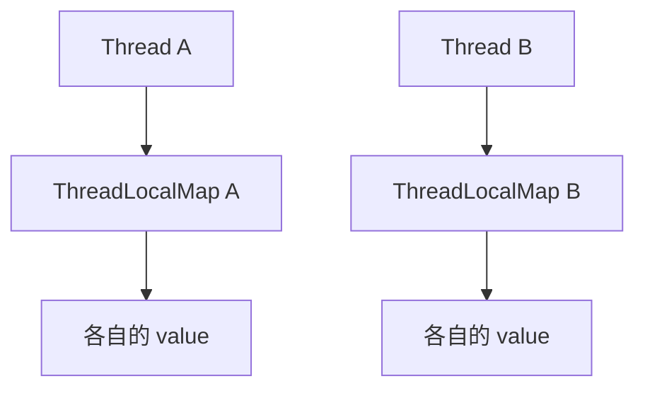

# JMM、volatile 与 ThreadLocal

本页将源资料的“主内存/工作内存、volatile、ThreadLocal”升级为 Java 内存模型与生产上下文治理。
锁实现见 [synchronized、CAS、AQS 与并发工具](./concurrency-locks-aqs-cas.md)，线程复用造成的上下文风险见
[线程池生产实践](./thread-pool-production-guide.md)。

## 90 秒面试回答

> Java Memory Model 定义线程间哪些写对哪些读可见，以及编译器、JIT 和 CPU 在什么约束下可以重排序。
> “主内存/工作内存”是规范的抽象交互模型，不能机械映射成“堆内存/L1 缓存”。判断并发正确性的核心是
> happens-before：如果两个冲突访问之间没有 happens-before，程序存在数据竞争，结果可能不是按源码顺序理解的结果。
>
> 对同一个 `volatile` 变量的写 happens-before 后续读。它提供可见性和特定顺序约束，但
> `count++` 是读、计算、写三个动作，仍不是原子复合操作。需要原子状态转换时选锁或原子类。
>
> `ThreadLocal` 不是共享变量同步工具，而是让每个线程关联独立值。平台线程池复用线程时，忘记清理会造成数据串租户和对象滞留；虚拟线程减少复用污染但会放大每线程数据成本。JDK 25 的 Scoped Values 更适合词法作用域内的只读上下文，但框架事务/MDC 迁移必须逐项验证。

## JMM 解决的不是“数据放在哪里”

JMM 是语言级语义：

- 每个线程有哪些动作；
- 哪些动作按线程内顺序观察；
- 哪些同步动作建立跨线程顺序；
- 一个读允许观察到哪个写；
- 数据竞争程序可能出现哪些行为。

CPU Cache、Store Buffer、内存屏障和一致性协议是 JVM 实现这些语义的手段。面试中可以用硬件帮助理解，但不能说：

- “主内存就是堆”；
- “工作内存就是线程栈或 CPU L1”；
- “volatile 每次都强制直接从物理内存读取”；
- “源码前后两行在所有线程中都按相同顺序执行”。

正确推理单位是同步关系，不是猜测某个值“此刻在哪一级缓存”。

## Happens-Before：可传递的可见性契约

若动作 A happens-before B，则 A 的效果对 B 可见，并且 A 在内存模型顺序上先于 B。常用规则：

| 规则 | 含义 |
|---|---|
| 程序次序 | 一个线程内，前一个动作 happens-before 后续动作 |
| Monitor | 对 Monitor 的解锁 happens-before 后续对同一 Monitor 的加锁 |
| volatile | 对变量的写 happens-before 后续对同一变量的读 |
| 线程启动 | 调用 `Thread.start()` 前的动作 happens-before 被启动线程中的动作 |
| 线程终止 | 线程内所有动作 happens-before 其他线程成功检测它已终止，例如 `join()` 返回 |
| 中断 | 调用 `interrupt()` happens-before 目标线程检测到中断 |
| 传递性 | A→B 且 B→C，可推出 A→C |

### 消息传递示例

```java
final class ResultBox {
    private int result;
    private volatile boolean ready;

    void publish(int value) {
        result = value;   // 普通写
        ready = true;     // volatile 写
    }

    int read() {
        if (!ready) {     // volatile 读
            throw new IllegalStateException("not ready");
        }
        return result;    // 能观察到 publish 中先前的 result 写
    }
}
```

推理链：`result` 普通写按程序次序 happens-before `ready` 写；volatile 写 happens-before 观察到它的后续读；读 `ready` 又按程序次序先于读 `result`，通过传递性得到正确可见性。

这不代表多个发布者可以安全同时写 `result`。如果需要多写者状态机，还要建立原子所有权或版本条件。

## 数据竞争、竞态条件与原子性

两个线程访问同一变量，至少一个是写，而且既无 happens-before 也无其他同步，就存在数据竞争。竞态条件更宽：结果依赖不可控时序，即使单次读写都是原子的，检查后执行仍可能出错。

```java
if (!orders.containsKey(id)) {  // check
    orders.put(id, create());   // act
}
```

即使 `orders` 换成线程安全 Map，上面两个调用的组合也未必原子。应使用 `putIfAbsent`、`computeIfAbsent`（注意回调约束）、锁，或数据库唯一键表达不变量。

P8 回答要区分：

- **可见性**：能否看到别的线程写入；
- **原子性**：操作是否不可分割；
- **有序性**：哪些重排序对其他线程可观察；
- **进展性**：线程是否可能饥饿、活锁或永远等待。

## volatile 的能力与边界

### 能保证什么

1. 单次 volatile 读/写具有规范定义的原子与可见性语义；
2. 对同一变量的 volatile 写与后续读建立 synchronizes-with/happens-before；
3. 限制可能破坏该语义的编译器与 CPU 重排序；
4. 所有线程看到对同一个 volatile 变量的一致同步顺序。

### 不能保证什么

```java
private volatile int count;

void increment() {
    count++; // 读 count、加一、写 count；两个线程可能丢更新
}
```

替代方案取决于语义：

- 精确线性化计数：`AtomicLong.incrementAndGet()`；
- 高竞争统计指标：`LongAdder`，接受 `sum()` 不是原子快照；
- 多字段不变量：锁或 `AtomicReference<ImmutableState>`；
- 跨进程不变量：数据库条件更新、唯一约束或协调协议。

### 合适用法

| 场景 | 是否适合 | 原因 |
|---|---|---|
| 停止标志 | 适合 | 一个写者/多个读者，状态独立 |
| 不可变配置快照引用 | 适合 | 一次替换整个安全构造快照 |
| 统计递增 | 不适合单独使用 | 复合读改写不原子 |
| 两个字段必须同步变化 | 不适合两个 volatile | 读者可能观察到混合版本 |
| 单例双重检查 | 适合，但实例引用必须 volatile | 防止不安全发布与旧值读取 |

## 双重检查锁定为什么需要 volatile

```java
final class ClientRegistry {
    private static volatile ClientRegistry instance;

    static ClientRegistry getInstance() {
        ClientRegistry local = instance;
        if (local == null) {
            synchronized (ClientRegistry.class) {
                local = instance;
                if (local == null) {
                    local = new ClientRegistry();
                    instance = local;
                }
            }
        }
        return local;
    }
}
```

没有 volatile 时，另一个线程可能在缺少安全发布关系的情况下观察对象引用。局部变量减少常见路径的 volatile 读取，但这是优化细节；更简单的初始化方式通常更好：静态初始化、Initialization-on-demand holder 或依赖注入容器。

## final 字段与安全发布

构造完成且 `this` 没有在构造期间逸出时，JMM 对 final 字段提供初始化安全性：其他线程通过对象引用读取 final 字段时能获得特殊保证。但它不自动保护：

- final 引用指向对象的后续可变字段；
- 构造函数中把 `this` 注册给监听器、线程或全局容器；
- 对象发布后的非 final 可变状态；
- 不受控制的反射/底层写入。

安全发布常见方式：

- 类初始化完成后通过 `static final` 暴露；
- 写入 volatile 引用，再由读者 volatile 读取；
- 在同一把锁内写入/读取共享引用；
- 放入正确使用的并发容器；
- 通过线程启动、任务提交等 API 的内存一致性保证传递。

“对象是不可变的”必须包含传递性不可变：内部集合不应暴露可变引用。

## volatile 与 synchronized 的选择

| 维度 | volatile | synchronized/Lock |
|---|---|---|
| 互斥 | 不提供 | 提供 |
| 可见性 | 对该变量建立同步关系 | 对同一锁保护的状态建立同步关系 |
| 复合不变量 | 通常不适合 | 适合 |
| 阻塞 | 不阻塞 | 竞争时可能阻塞/park |
| 典型场景 | 状态标志、快照引用 | 多步状态转换、临界区、条件等待 |

volatile 不是“轻量级 synchronized”。二者表达的协议不同；先定义不变量和并发协议，再选择原语。

## ThreadLocal 的真实模型

`ThreadLocal<T>` 为每个访问它的线程提供独立值。它解决的是“如何将值绑定到线程”，不是让一个共享可变对象自动线程安全。



在当前 OpenJDK 实现中，Map 位于 `Thread` 上；Entry 的 key 是对 `ThreadLocal` 的弱引用，而 value 是普通强引用。key 被回收后，value 不会因此立即消失，只会在 Map 后续操作的启发式清理或线程终止时被释放。

因此“ThreadLocal key 是弱引用，所以不会泄漏”是错的；“任何 ThreadLocal 都一定泄漏”也不准确。风险取决于线程寿命、是否仍有强 key、value 大小和后续清理机会。

## 平台线程池中的两类事故

### 数据串请求

```java
private static final ThreadLocal<String> TENANT = new ThreadLocal<>();

void handle(Request request) {
    TENANT.set(request.tenantId());
    try {
        service.process(request);
    } finally {
        TENANT.remove();
    }
}
```

线程池复用 Worker。若异常路径忘记 `remove()`，下一请求可能读到上一个租户、用户或 Trace，属于隔离与安全问题，不只是内存问题。

### 对象滞留与类加载器泄漏

长寿命 Worker 可通过 ThreadLocalMap 持有大型 value。应用热部署时，value 还可能引用旧应用类加载器，阻止整套类卸载。应：

1. 在最外层任务边界 `try/finally` 清理；
2. 不在 ThreadLocal 缓存大 Buffer、客户端、连接或对象池；
3. 由创建上下文的组件负责关闭和恢复；
4. 用堆转储的 GC Root 路径证明滞留，而不是看到 ThreadLocal 就下结论。

## 上下文传播不是复制所有 ThreadLocal

异步线程池、`CompletableFuture` 和虚拟线程不会自动满足业务需要的上下文传播。`InheritableThreadLocal` 在池化线程上尤其危险：继承发生在线程创建时，不是每次任务提交时；复制可变对象还可能造成共享和成本放大。

设计上下文时分三类：

| 上下文 | 推荐策略 |
|---|---|
| Trace ID、Tenant ID、Deadline 等只读请求值 | 显式参数、框架 Context，JDK 25 可评估 Scoped Values |
| MDC、SecurityContext 等框架值 | 使用框架提供的 TaskDecorator/传播器并集成测试 |
| JDBC 事务、Session、连接 | 不跨线程复制；重新定义事务边界 |

提交任务时应捕获必要快照，执行时安装，并在 `finally` 恢复原值。不能枚举并复制 JVM 中所有 ThreadLocal，也不能把请求的整个可变对象图塞进上下文。

## 虚拟线程与 Scoped Values

虚拟线程通常一任务一线程，任务结束后线程也结束，减少平台线程池的“下一任务读到旧值”问题；但百万虚拟线程会放大每线程 ThreadLocal value 的总内存，所以不能用它缓存大对象。

JDK 25 的 Scoped Values 已成为正式特性，适合受控调用树中的只读上下文：

```java
private static final ScopedValue<String> TENANT_ID = ScopedValue.newInstance();

void handle(Request request) {
    ScopedValue.where(TENANT_ID, request.tenantId())
        .run(() -> service.process(request));
}
```

优势是词法作用域、只读绑定和自动退出作用域。但它不是所有 ThreadLocal 的一键替代：Spring 事务、MDC、安全上下文和旧库的 API 都必须验证。Structured Concurrency 在 JDK 25 仍为 Preview，不能因为 Scoped Values 正式就混为同一稳定级别。

## 线上排查内存可见性与 ThreadLocal

### 并发正确性

- 先找共享可变状态和不变量；
- 绘制写入、读取之间的 happens-before 链；
- 检查 check-then-act、丢更新、错误发布和超时后的晚到写；
- 用 JCStress 或确定性并发测试验证允许结果集合；
- 生产用 JFR/线程转储定位锁与调度，不能靠加 `sleep` 复现。

普通单元测试跑 1,000 次都不失败，不能证明没有数据竞争；时序窗口、编译级别和 CPU 架构都可能改变表现。

### ThreadLocal 滞留

1. 获取堆转储并保留采集时环境信息；
2. 从大对象的 GC Roots 回溯到 `Thread`、`ThreadLocalMap` 与 Entry；
3. 区分活跃 key、`key = null` 的 stale entry、框架合法长寿命值；
4. 找到设置点、清理点和线程池边界；
5. 修复后以相同流量验证 Old Gen 占用、对象数量和跨请求污染测试。

## P8 连续追问

### volatile 写之前的普通写为什么对读者可见

线程内程序次序、同一变量 volatile 写到读的同步关系，再加 happens-before 传递性，把之前的普通写传递给观察到该 volatile 值的读者。

### 两个 volatile 字段能否维护联合不变量

通常不能。每个字段的单次访问有同步语义，但读者可能在两次读取间遇到写者更新，看到混合版本。用不可变快照加单个 volatile 引用、原子引用或锁。

### 为什么 synchronized 不只等于互斥

解锁到后续同锁加锁建立 happens-before。没有这条内存语义，即使同一时刻只有一个线程执行，也不能完整解释写入如何对下一持锁者可见。

### ThreadLocal 为什么会串租户

ThreadLocal 值绑定在线程而非请求。平台 Worker 被复用，上一任务未清理的值仍留在同一线程 Map 中，下一任务就能读到。

### ScopedValue 为什么更适合只读请求上下文

它在明确词法范围内绑定不可变引用，调用结束自动离开作用域，不依赖手工 `remove`，也更符合虚拟线程与结构化任务的上下文模型；但必须由调用树接收，不能充当任意可变全局槽位。

## 官方资料

- [JLS 17：Threads and Locks](https://docs.oracle.com/javase/specs/jls/se25/html/jls-17.html)
- [JLS 17.4.5：Happens-Before Order](https://docs.oracle.com/javase/specs/jls/se25/html/jls-17.html#jls-17.4.5)
- [JLS 17.5：final Field Semantics](https://docs.oracle.com/javase/specs/jls/se25/html/jls-17.html#jls-17.5)
- [Java SE 25 ThreadLocal](https://docs.oracle.com/en/java/javase/25/docs/api/java.base/java/lang/ThreadLocal.html)
- [OpenJDK ThreadLocal 源码](https://github.com/openjdk/jdk/blob/jdk-25-ga/src/java.base/share/classes/java/lang/ThreadLocal.java)
- [Java SE 25 java.util.concurrent 包内存一致性说明](https://docs.oracle.com/en/java/javase/25/docs/api/java.base/java/util/concurrent/package-summary.html#MemoryVisibility)
- [OpenJDK JEP 506：Scoped Values](https://openjdk.org/jeps/506)
