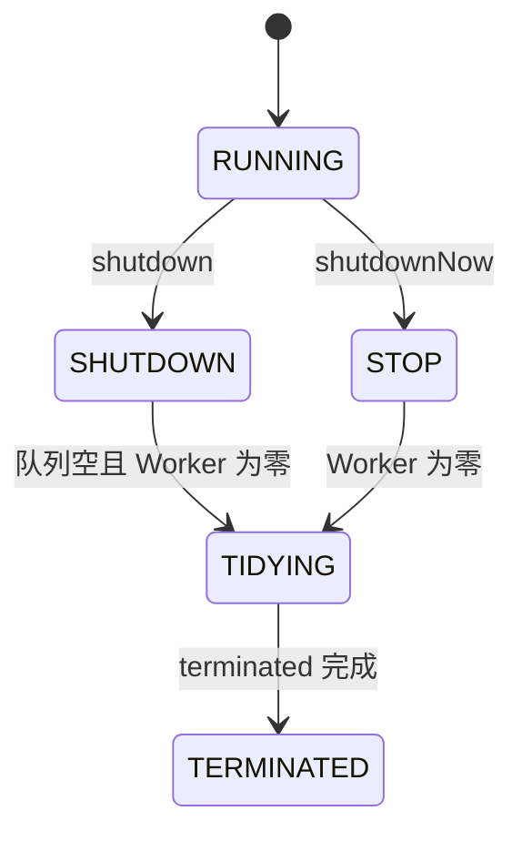
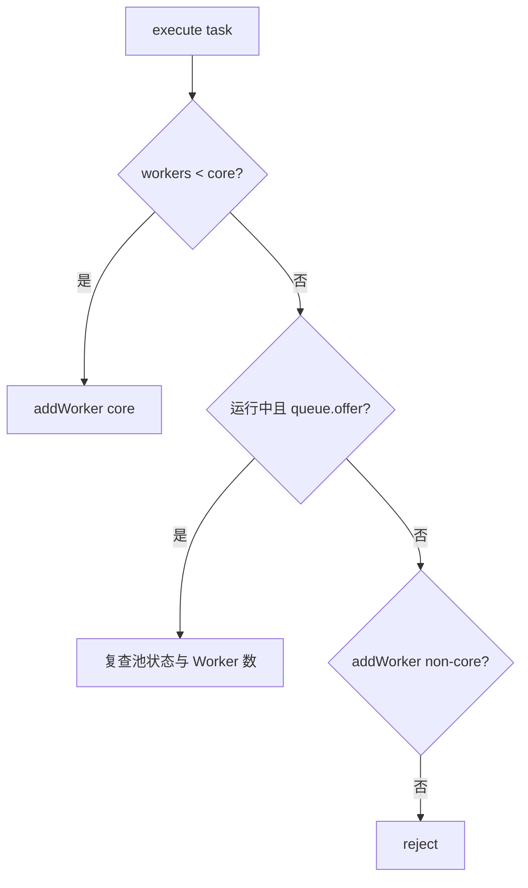

# Java 线程池生产实践

本页把源资料的线程池参数、执行流程和 `Executors` 工厂扩展为生产级容量与故障治理。
锁与 AQS 见 [synchronized、CAS、AQS 与并发工具](./concurrency-locks-aqs-cas.md)，
虚拟线程的替代边界见 [虚拟线程生产架构模式](./virtual-threads-production-patterns.md)。

## 90 秒面试回答

> `ThreadPoolExecutor` 的价值不是单纯复用线程，而是同时控制线程、排队、过载和生命周期。
> `execute` 时，运行 Worker 少于 `corePoolSize` 就先建核心 Worker；否则先尝试入队；入队成功后必须复查池状态；队列满时再尝试建非核心 Worker，超过 `maximumPoolSize` 或池已关闭才拒绝。
>
> 生产配置必须把线程数、队列容量、拒绝策略、超时和业务降级一起设计。无界队列会让
> `maximumPoolSize` 基本失效并把过载变成长排队和 OOM；无界线程则把过载变成上下文切换和内存耗尽。
> 容量从到达率、服务时间、CPU/下游上限和排队 SLO 推导，再压测校准。
>
> JDK 21–25 的虚拟线程适合高并发阻塞 I/O，但不是用一个固定大小“虚拟线程池”替换所有平台线程池。
> CPU 任务仍需有界平台线程池，下游容量改由 Semaphore、连接池和 Rate Limiter 表达。

## ThreadPoolExecutor 的状态与 Worker

从公开契约看，线程池管理运行状态、Worker 集合、工作队列与完成统计。从当前 OpenJDK 实现看，`ctl` 把运行状态和 Worker 数编码进一个原子字段，这是理解并发状态转换的实现细节，不是应用可以依赖的 API。

典型运行状态：



- `RUNNING`：接收新任务并处理队列任务；
- `SHUTDOWN`：不接收新任务，继续处理已入队任务；
- `STOP`：不接收新任务，不再处理队列，并尝试中断正在执行的任务；
- `TIDYING/TERMINATED`：完成收尾和终止钩子。

`Worker` 既持有执行线程，也作为 AQS 独占同步器保护 Worker 自身运行状态。应用侧不应反射这些内部结构，而应使用公开统计、JFR、指标和线程转储。

## execute 的完整决策路径



不能漏掉“入队后复查”：任务入队与线程池关闭可能并发发生。实现会在池不再运行时尝试移除并拒绝该任务；若池仍运行但没有 Worker，则补一个 Worker，避免任务永久留在队列。

按行为拆开：

1. `workerCount < corePoolSize`：尝试直接创建 Worker，即使其他 Worker 当前空闲；
2. 否则池仍运行时调用 `workQueue.offer`；
3. 入队成功后复查状态与 Worker 数；
4. 入队失败时尝试创建非核心 Worker，受 `maximumPoolSize` 限制；
5. 池非运行态、线程上限已到或线程创建失败时进入拒绝处理。

因此使用无界队列时，队列几乎总能 `offer` 成功，Worker 通常不会超过核心数，`maximumPoolSize` 基本不起扩容作用。

## 七个构造参数要形成一个系统

| 参数 | 决策问题 | 常见错误 |
|---|---|---|
| `corePoolSize` | 常态并发需要多少平台线程 | 直接等于机器核数，不看阻塞比 |
| `maximumPoolSize` | 峰值允许多少 Worker | 配了无界队列却期待它自动扩容 |
| `keepAliveTime` | 超出核心数的空闲 Worker 等待多久回收 | 设很大造成线程长期驻留 |
| `unit` | `keepAliveTime` 使用什么时间单位 | 数值与单位错配造成回收时间放大 |
| `workQueue` | 允许积压多少、按什么顺序 | 无界队列掩盖持续过载 |
| `threadFactory` | 名称、异常、优先级、上下文 | 默认名字导致难以定位业务池 |
| `handler` | 饱和时丢、退、阻塞还是降级 | 静默丢任务且无指标 |

`allowCoreThreadTimeOut(boolean)` 不是构造参数，而是创建后的运行时策略。启用后，核心 Worker 也可按非零 Keep-Alive 回收；是否启用要权衡低流量资源占用与冷启动延迟。

一个显式、有界、可观测的起点：

```java
ThreadFactory factory = Thread.ofPlatform()
    .name("payment-callback-", 0)
    .uncaughtExceptionHandler((thread, error) ->
        log.error("uncaught task error, thread={}", thread.getName(), error))
    .factory();

ThreadPoolExecutor executor = new ThreadPoolExecutor(
    16,
    32,
    60,
    TimeUnit.SECONDS,
    new ArrayBlockingQueue<>(500),
    factory,
    new ThreadPoolExecutor.AbortPolicy());
```

这些数字只是示例，不能复制到生产。还要配置任务超时、取消、业务级降级和指标。

## 三类队列策略

| 队列 | 行为 | 适用与风险 |
|---|---|---|
| `SynchronousQueue` | 不存任务，提交者与 Worker 直接交接 | 响应快但要求线程上限/拒绝设计严谨，否则线程暴涨 |
| 无界 `LinkedBlockingQueue` | 达核心数后持续入队 | 平滑短突发，但持续过载会造成长延迟、对象滞留和 OOM |
| 有界队列 | 满后再扩到最大线程，最终拒绝 | 能形成确定过载边界，但需按 SLO 和容量调优 |

队列不是免费缓冲。队列中的每个任务会保留参数、闭包、Trace/MDC 和业务对象，排队时间还消耗请求 Deadline。P8 回答要把“队列长度”换算为内存和延迟预算。

## Executors 工厂的生产风险

源资料只列出四个工厂，没有说明隐含边界：

| 工厂 | 隐含配置 | 风险 |
|---|---|---|
| `newFixedThreadPool(n)` | 固定 Worker + 无界共享队列 | 持续过载时队列无限增长，最大线程数不会救场 |
| `newSingleThreadExecutor()` | 单 Worker + 无界队列 | 一个慢任务阻塞全队列；积压无上限 |
| `newCachedThreadPool()` | `SynchronousQueue` + 近似无界最大线程数 | 下游变慢或突发时线程数量失控 |
| `newScheduledThreadPool(n)` | 延迟任务队列 + 固定核心 Worker | 长任务拖延后续调度；周期任务异常后可能停止继续调度 |

不是“永远禁止 `Executors`”，而是生产服务必须识别并接受它的边界。生命周期短、任务数严格受控的工具程序可以合理使用；长期运行服务通常需要显式容量、命名、拒绝和观测。

## 容量推导：先算约束，再压测

### CPU 密集任务

无外部阻塞时，平台 Worker 通常从 CPU 可用核数附近开始：

$$
N_{threads} \approx N_{cpu}
$$

如果同机还有 GC、Netty、数据库代理或其他进程，要预留核数。线程远多于核数不会增加纯 CPU 吞吐，反而增加调度、缓存失效和尾延迟。

### 阻塞任务

传统平台线程池可用等待/计算比做第一轮估算：

$$
N_{threads} \approx N_{cpu} \times (1 + W/S)
$$

`W` 是等待时间，`S` 是实际计算时间。这只是封闭负载的起点；还必须受数据库连接、HTTP 连接、远端 QPS、内存和调度开销的更小上限约束。

### 用 Little's Law 检查在途量

稳定状态下：

$$
L = \lambda W
$$

若到达率 2,000/s、平均端到端停留 200ms，则平均约有 400 个在途任务。若线程池只能同时执行 100 个且任务平均服务 100ms，持续到达率已经超过服务能力，调大队列只会延迟失败。

### 队列容量绑定等待 SLO

队列容量不是“越大越抗峰值”。可先用允许排队时间与可持续处理率估算：

$$
Q_{budget} \leq \mu \times W_{queue\_budget}
$$

例如可持续完成 1,000/s、只允许排队 100ms，初始队列预算不应远大于约 100 个任务；随后必须用真实服务时间分布和突发模型压测。平均值不能替代 P95/P99。

## 拒绝策略就是业务语义

| 策略 | 行为 | 生产判断 |
|---|---|---|
| `AbortPolicy` | 抛 `RejectedExecutionException` | 默认最透明，上层必须映射重试/降级/错误码 |
| `CallerRunsPolicy` | 池未关闭时由提交线程执行；已关闭时丢弃 | 可形成反馈，但可能阻塞事件循环、消费线程或持锁线程 |
| `DiscardPolicy` | 静默丢弃 | 只有任务明确可丢且已有计数/补偿时才考虑 |
| `DiscardOldestPolicy` | 池未关闭时丢队首再重试；已关闭时丢弃 | 会破坏时序，官方文档也提示极少合适 |

支付回调、告警处置、账务任务通常不能静默丢。可靠任务应落持久队列/Outbox 后异步处理；内存线程池只负责本进程调度，不能充当消息系统。

拒绝处理器不会让“提交与 shutdown 并发”的任务自动可靠。调用方仍要处理异常或明确检测执行结果；需要必达时，先持久化任务，再由具备重试与幂等协议的消费者执行。

自定义拒绝器至少记录池名、队列深度、Active、任务类型和 Trace ID，但不要在饱和路径同步写慢日志或远程上报，避免二次阻塞。

## execute、submit 与异常可见性

- `execute(Runnable)` 不返回结果；未捕获异常通常到 Worker/UncaughtExceptionHandler，并可能使 Worker 退出后重建。
- `submit(...)` 把任务包装成 `FutureTask`；异常保存在 `Future` 中，调用 `get()` 才以 `ExecutionException` 暴露。
- 如果提交后从不 `get`、不检查 Future，也没有统一 `afterExecute` 解包，失败可能长期沉默。

生产方案：

1. 有返回值/必须确认完成的任务，保存 Future 并设超时获取；
2. Fire-and-forget 任务在任务边界显式捕获、记录和计数；
3. `afterExecute` 若要统一提取 Future 异常，必须避免再次阻塞；
4. 取消任务后清理队列中的已取消 Future，可评估 `remove`/`purge` 策略。

## 上下文传播与污染

平台线程池会复用线程，所以 `ThreadLocal`、MDC、租户和安全上下文若不清理，会泄漏到下一任务。提交时捕获、执行前安装、`finally` 恢复旧值：

```java
Runnable wrap(Runnable task, String traceId) {
    return () -> {
        String previous = TraceContext.get();
        try {
            TraceContext.set(traceId);
            task.run();
        } finally {
            if (previous == null) {
                TraceContext.clear();
            } else {
                TraceContext.set(previous);
            }
        }
    };
}
```

不要只 `remove` 当前值后假设没有嵌套调用；通用装饰器应保存并恢复原上下文。框架提供的 TaskDecorator/Context Propagation 应优先于自制不完整拷贝。

## 优雅停机

```java
executor.shutdown();
try {
    if (!executor.awaitTermination(30, TimeUnit.SECONDS)) {
        List<Runnable> neverStarted = executor.shutdownNow();
        log.warn("forced shutdown, queued={}", neverStarted.size());
        if (!executor.awaitTermination(10, TimeUnit.SECONDS)) {
            log.error("executor did not terminate");
        }
    }
} catch (InterruptedException interrupted) {
    executor.shutdownNow();
    Thread.currentThread().interrupt();
}
```

真正的停机协议还包括：

1. 从负载均衡摘流量并停止接收新任务；
2. 停止消息拉取/定时调度；
3. 等待在途任务 Drain 到 Deadline；
4. 中断仍运行任务，业务代码要尊重中断；
5. 对未完成任务执行重投、补偿或持久化接管；
6. 最后关闭连接池与客户端。

`shutdownNow()` 只是尝试中断，不能强制停止忽略中断或阻塞在不可中断 I/O 的代码。

## 平台线程池与虚拟线程的边界

| 负载 | 推荐承载 | 容量控制 |
|---|---|---|
| CPU 计算 | 有界平台线程池 | 核数、运行队列、CPU 配额 |
| 大量阻塞 I/O | 一任务一虚拟线程 | 入口、Semaphore、连接池、Deadline |
| 固定顺序消费 | 按 Key/Partition 的有限执行器 | 顺序与 Offset 协议 |
| 定时任务 | Scheduled Executor/框架调度器 | 调度漂移、重入、分布式租约 |
| 可靠异步任务 | Kafka/持久任务表 + 消费执行器 | 重试、幂等、DLQ、恢复 |

虚拟线程不应该放进固定大小池来表达下游容量；这会重新引入 Worker 排队。使用
`Executors.newVirtualThreadPerTaskExecutor()` 表达任务生命周期，再用资源舱壁限制数据库、模型 API 和文件句柄。CPU 工作仍切到有界平台线程池。

## 监控指标与耗尽 Runbook

### 最小指标集

- `poolSize`、`activeCount`、`largestPoolSize`；
- 队列当前长度、容量使用率、队首等待时间；
- 提交、开始、完成、失败、取消、拒绝计数；
- 任务执行 P50/P95/P99 与端到端 Deadline 剩余量；
- 下游连接池 Pending、QPS、429/5xx 和超时；
- JVM CPU、GC、堆、线程数和上下文切换。

### 故障判断树

1. **Active 到上限、队列持续上涨**：服务率低于到达率；查下游变慢、任务变重或流量突增。
2. **Active 低、队列却有任务**：检查 Worker 创建失败、线程工厂返回 `null`、池状态或 Worker 死亡。
3. **队列满且拒绝上涨**：确认降级生效，先保护系统，不要现场盲目调大队列。
4. **CPU 满**：减少平台 Worker/隔离 CPU 工作，分析 JFR CPU Hotspot。
5. **CPU 低但 Active 满**：通常在锁、连接池或 I/O 等待；用线程转储和下游指标定位。
6. **只有 P99 恶化**：看队首等待、长尾任务、GC 和 Head-of-Line Blocking。

应急扩容前先确认瓶颈是否在下游。应用实例翻倍可能把数据库或第三方 API 直接压垮。

## P8 连续追问

### 为什么无界队列会让 maximumPoolSize 失效

达到核心线程数后，执行器优先 `offer` 入队。无界队列几乎不会满，因此不会进入“入队失败后创建非核心 Worker”的分支，Worker 数通常停在核心数。

### CallerRunsPolicy 为什么可能制造事故

它在提交线程中执行任务。若提交者是 Netty EventLoop、Kafka Poll 线程、调度线程或持锁线程，会阻塞关键控制流，造成连接停顿、Rebalance、调度漂移或锁持有时间暴涨。

### 为什么队列长度不是一个充分告警

同样 100 个任务，单任务 1ms 和 10s 完全不同。要看队首等待时间、到达/完成速率、任务耗时分位数、剩余 Deadline 和下游 Pending。

### 为什么 submit 的异常可能丢失

`submit` 把异常存入 Future。调用方不执行 `get`，又没有任务边界日志或统一 Future 检查时，Worker 不会像裸 `execute` 那样把异常直接交给 UncaughtExceptionHandler。

### 怎样证明线程池大小合理

给出约束模型、真实到达/服务时间分布、队列等待 SLO、下游上限和压测曲线；再展示饱和点、拒绝/降级行为、故障注入和回滚条件。只报一个公式或固定线程数不算证据。

## 官方资料

- [Java SE 25 ThreadPoolExecutor](https://docs.oracle.com/en/java/javase/25/docs/api/java.base/java/util/concurrent/ThreadPoolExecutor.html)
- [Java SE 25 Executors](https://docs.oracle.com/en/java/javase/25/docs/api/java.base/java/util/concurrent/Executors.html)
- [Java SE 25 ExecutorService](https://docs.oracle.com/en/java/javase/25/docs/api/java.base/java/util/concurrent/ExecutorService.html)
- [OpenJDK ThreadPoolExecutor 源码](https://github.com/openjdk/jdk/blob/jdk-25-ga/src/java.base/share/classes/java/util/concurrent/ThreadPoolExecutor.java)
- [Java SE 25 Virtual Threads](https://docs.oracle.com/en/java/javase/25/core/virtual-threads.html)
- [OpenJDK JEP 444：Virtual Threads](https://openjdk.org/jeps/444)
