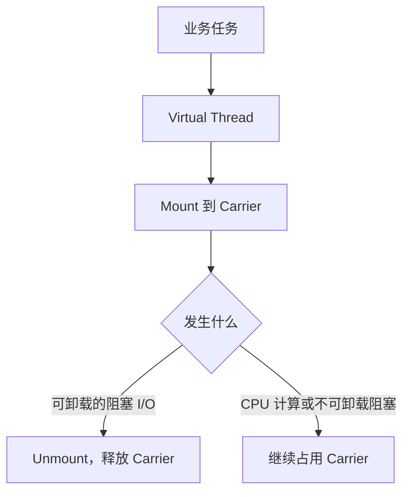

# JDK 21–25 虚拟线程版本演进

本页解释虚拟线程的调度模型和 JDK 版本边界。生产控制模式见
[虚拟线程生产架构模式](./virtual-threads-production-patterns.md)，上线验证见
[虚拟线程观测、压测与迁移](./virtual-threads-observability-migration.md)。

## 一句话结论

虚拟线程通过“任务阻塞时释放稀缺 Carrier”提升高并发阻塞 I/O 服务的可扩展性。它主要提高吞吐和简化同步代码，不会让 SQL、网络 RTT、模型推理或 CPU 计算本身变快。

## 90 秒面试回答

> 虚拟线程仍是 `java.lang.Thread`，但不与操作系统线程一一绑定。大量虚拟线程由 JVM 调度到较少的 Carrier 平台线程上；遇到 JVM 能识别的阻塞 I/O 时，虚拟线程通常会 Unmount，让 Carrier 去执行其他任务。因此它适合请求数很多、等待占比高的 Servlet、JDBC、HTTP/RPC 聚合链路。
>
> 版本上，JDK 21 通过 JEP 444 正式交付虚拟线程，但在 `synchronized` 临界区中发生阻塞时要重点排查 Pinning。JDK 24 的 JEP 491 去除了普通 Java Monitor 导致的这类 Pinning；这不等于没有锁竞争，native/FFM 长阻塞也仍需关注。JDK 25 的 Scoped Values 已正式，而 Structured Concurrency 仍是 Preview。生产落地必须同时做入口限流、每个下游的容量舱壁、总 Deadline、CPU 隔离和 JFR/线程转储观测。

## 调度模型



术语：

- **Virtual Thread**：通常与一个业务任务对应，生命周期短，不复用。
- **Carrier**：执行虚拟线程代码的平台线程。
- **Mounted**：虚拟线程正在 Carrier 上运行。
- **Unmounted**：虚拟线程等待时已释放 Carrier。
- **Pinning**：虚拟线程阻塞却无法释放 Carrier，可能降低系统可扩展性。

平台线程和虚拟线程的核心差异：

| 维度 | 平台线程 | 虚拟线程 |
|---|---|---|
| OS 线程关系 | 通常接近一一对应 | 大量任务复用少量 Carrier |
| 典型使用 | 固定/弹性线程池复用 | 一任务一线程 |
| 阻塞成本 | 阻塞期间占用 OS 线程 | 可 Unmount 时释放 Carrier |
| 适合负载 | CPU 计算、有限并发 | 高并发、阻塞 I/O 为主 |
| 限流方式 | 线程池大小和队列常同时承担 | Semaphore、连接池、限流器 |

## 吞吐、并发与延迟

虚拟线程不会把 200ms 的下游调用变成 20ms。它能消除的主要是“等待平台线程池空闲”的排队时间，并让同样的 OS 线程承载更多等待任务。

稳定系统可以用 Little's Law 做第一轮检查：

$$
L = \lambda W
$$

如果目标吞吐为 5,000 QPS，平均停留时间为 200ms，则系统中平均约有：

$$
5{,}000 \times 0.2 = 1{,}000
$$

个进行中的请求。虚拟线程能自然表达这 1,000 个任务，但数据库、模型服务和第三方 API 仍必须有对应容量；否则瓶颈只会从应用线程池转移到下游。

## JDK 21、24、25 的版本分界

| 版本 | 状态 | Pinning 重点 | 生产判断 |
|---|---|---|---|
| JDK 21 LTS | JEP 444 正式特性 | Monitor 内阻塞、native/FFM | 可生产使用，但要审计锁内 I/O |
| JDK 22/23 | 虚拟线程仍为正式特性 | 行为总体接近 JDK 21 | 迁移时仍按旧 Pinning 模型排查 |
| JDK 24 | JEP 491 交付 | 普通 Monitor 不再造成该类 Pinning；native/FFM 仍需关注 | 锁迁移成本显著下降 |
| JDK 25 LTS | 延续 JEP 491 | native/FFM 与业务锁竞争 | Scoped Values 正式；结构化并发仍预览 |

### JDK 21–23：审计锁内阻塞

```java
synchronized (lock) {
    // JDK 21–23：这里若执行长时间 JDBC/HTTP 阻塞，需要重点排查 Pinning
    return jdbcClient.fetchOrder(orderId);
}
```

正确优化顺序：

1. 用 JFR 或 `-Djdk.tracePinnedThreads` 找到证据；
2. 缩短临界区，把远程 I/O 移出锁；
3. 按订单、租户或资源分段，降低共享；
4. 只有无法拆分且确有 Pinning 时，再评估 `ReentrantLock`。

不能为了“虚拟线程最佳实践”把整个代码库的 `synchronized` 机械替换掉。锁语义改变本身会引入正确性风险。

### JDK 24/25：Monitor Pinning 消失，不代表锁消失

JEP 491 让虚拟线程在因普通 `synchronized` Monitor 阻塞时能够释放 Carrier。两个问题必须分开：

- **Pinning**：Carrier 是否被不必要占用；
- **Contention**：大量请求是否仍被同一把锁串行化。

JDK 25 上 10,000 个请求排在一个全局锁后面，可能没有 `jdk.VirtualThreadPinned` 事件，但业务仍会因串行临界区产生高 P99。解决办法是减少共享、缩小锁粒度或按 Key 分区，而不是调大 Carrier 数量。

### JDK 25 Scoped Values

Scoped Values 适合在受控调用树内传递只读上下文，例如 Request ID、Tenant ID 和 Deadline：

```java
private static final ScopedValue<String> REQUEST_ID = ScopedValue.newInstance();

void handle(String requestId) {
    ScopedValue.where(REQUEST_ID, requestId)
        .run(() -> service.call(REQUEST_ID.get()));
}
```

相对 `ThreadLocal`，它强调：

- 只读绑定；
- 明确的词法作用域；
- 退出作用域后不再可见；
- 适合虚拟线程和结构化任务中的上下文继承。

这不意味着所有 `ThreadLocal` 都必须立即删除。Spring 事务、MDC 和安全上下文仍可能依赖线程绑定，迁移时要逐个验证框架语义；最先淘汰的是用 `ThreadLocal` 缓存大对象或可变对象池的做法。

### JDK 25 Structured Concurrency

Structured Concurrency 把同一业务请求的多个子任务作为一个生命周期单元处理，便于失败传播、取消和线程转储观察。但 JDK 25 中它仍是 Preview：

- 编译与运行需要 `--enable-preview`；
- API 仍可能在后续 JDK 变化；
- 企业项目必须明确 Preview 升级、回滚和依赖策略；
- 若组织不允许 Preview，可使用稳定的 `ExecutorService`、`Future` 和显式取消实现同样的生命周期约束。

## 适用与不适用场景

| 场景 | 价值判断 | 关键边界 |
|---|---|---|
| Spring MVC + JDBC | 高 | DB 连接池、事务、查询超时 |
| 多 HTTP/RPC 聚合 | 高 | 总 Deadline、舱壁、取消 |
| I/O 型批处理 | 高 | 有界提交、对象和文件句柄 |
| Kafka 单条处理 | 条件适用 | 分区顺序、Offset 和最大并发 |
| 已稳定的端到端 Reactor | 低或条件适用 | 不要叠加三套调度模型 |
| 加密、压缩、图像、模型推理 | 低 | CPU/GPU 才是真实边界 |
| 全局锁保护的串行业务 | 低 | 先消除共享和锁瓶颈 |

## 18 个生产误区压缩版

| 误区 | 实际风险 | 正确方向 |
|---|---|---|
| 虚拟线程降低单请求延迟 | 下游仍然一样慢 | 区分排队与服务时间 |
| 固定大小虚拟线程池 | 重新限制并发 | 一任务一虚拟线程 |
| 线程便宜就无限提交 | Heap、超时和下游雪崩 | 入口和下游有界并发 |
| DB 池会自动保护一切 | 数万任务可在池外等待 | 限制允许等待 DB 的请求 |
| CPU 任务也全部迁移 | Carrier 被 CPU 占满 | 有界平台线程池 |
| JDK 21 忽略锁内 I/O | Carrier Pinning | JFR 取证后改造 |
| JDK 24 后没有锁问题 | Contention 仍存在 | 减少共享、分段 |
| 忽略 native/FFM | 新版本仍可能 Pin | 隔离或升级本地库 |
| ThreadLocal 缓存大对象 | 每任务复制、Heap 膨胀 | 共享不可变对象或有界池 |
| 依赖 InheritableThreadLocal | 上下文复制成本和泄漏 | Scoped Values 或显式传播 |
| 子线程继承父事务 | 连接和事务并不传播 | 独立事务或事务外并发 |
| `supplyAsync` 自动变虚拟线程 | 默认仍走 Common Pool | 显式 Executor |
| 每个调用单独设超时 | 总时延可能叠加失控 | 绝对 Deadline |
| 吞掉中断 | 取消后任务继续运行 | 恢复中断并退出 |
| 忽略 daemon 属性 | CLI/服务可能提前退出 | Join、Close、Keep Alive |
| 仍用平台线程池指标 | 看不到真实排队 | 业务 Inflight + JFR/MXBean |
| 等待时持有大对象 | 大量任务保留堆对象 | 流式处理和边界限制 |
| Scheduler 默认都适合 | Fixed-delay 可能互相阻塞 | 验证真实调度器语义 |

## 版本选择决策

### 已在 JDK 21 LTS

可以使用虚拟线程，不必等到 JDK 25，但上线前必须：

- 扫描 `synchronized` 内的 JDBC、HTTP、文件和长等待；
- 开启 JFR 的 Pinning 观测；
- 验证依赖库是否存在 native 长阻塞；
- 保留入口级平台线程回退开关。

### 正在规划新基线

JDK 25 LTS 可减少 Monitor Pinning 改造，并提供正式 Scoped Values。是否启用 Structured Concurrency 要单独评审 Preview 风险，不能把“使用 JDK 25”和“启用所有预览 API”绑定在一起。

### 已经是 Reactor/Netty

若链路已经端到端非阻塞、运维成熟，虚拟线程未必带来收益。优先用于隔离无法异步化的 JDBC/SDK 边界，不要同时叠加 Reactor Scheduler、`CompletableFuture` 和虚拟线程，造成上下文与取消语义分裂。

## P8 连续追问

### 为什么虚拟线程不是“更小的平台线程”

因为它改变的是任务与 OS 线程的绑定方式。虚拟线程代表任务，Carrier 才是 JVM 用来执行代码的平台线程；阻塞时任务可以被挂起而 Carrier 继续服务其他任务。

### 为什么不池化虚拟线程

平台线程池是为了复用昂贵 OS 线程；虚拟线程便宜且一次性，池化会把并发重新卡在固定 Worker 数。资源上限应由 Semaphore、连接池、Rate Limiter 和入口 Admission Control 表达。

### Pinning 消失后为什么还要监控队列

因为 Carrier 仍会被 CPU 任务或 native 阻塞占用，业务锁仍可串行化请求，下游也会排队。`queued` 是症状，必须结合 CPU、JFR、锁和下游 Pending 判断根因。

### 虚拟线程是否能解决数据库连接池不足

不能。它只降低“等待连接时占用平台线程”的成本。数据库的最大安全并发由连接、SQL、锁、CPU 和 IO 决定；虚拟线程甚至可能更快地把流量推到连接池门口，所以必须加强背压。

## 官方资料

- [OpenJDK JEP 444: Virtual Threads](https://openjdk.org/jeps/444)
- [OpenJDK JEP 491: Synchronize Virtual Threads without Pinning](https://openjdk.org/jeps/491)
- [OpenJDK JEP 506: Scoped Values](https://openjdk.org/jeps/506)
- [OpenJDK JEP 505: Structured Concurrency, Fifth Preview](https://openjdk.org/jeps/505)
- [Oracle JDK 25 Virtual Threads](https://docs.oracle.com/en/java/javase/25/core/virtual-threads.html)
- [Oracle JDK 25 Scoped Values](https://docs.oracle.com/en/java/javase/25/core/scoped-values.html)
- [Oracle JDK 25 Structured Concurrency](https://docs.oracle.com/en/java/javase/25/core/structured-concurrency.html)
