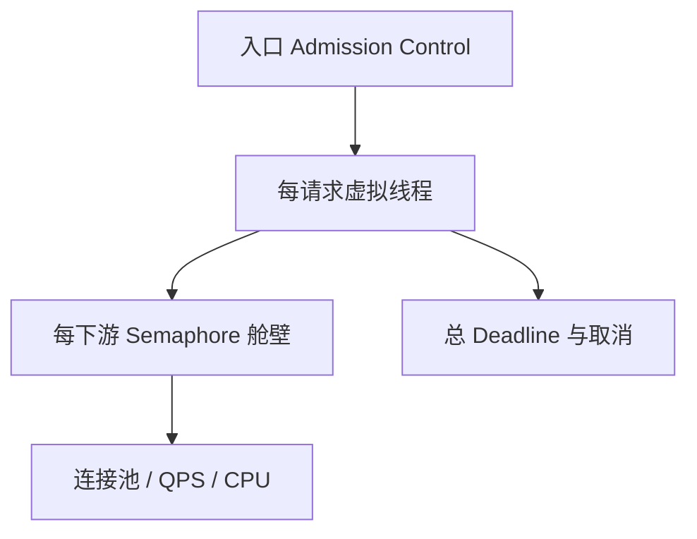

# 虚拟线程生产架构模式

本页关注高并发阻塞 I/O 服务的生产控制模式。版本差异见
[JDK 21–25 虚拟线程版本演进](./virtual-threads-jdk21-25.md)，上线门禁见
[虚拟线程观测、压测与迁移](./virtual-threads-observability-migration.md)。

## 总原则：线程可以便宜，资源不会变多

虚拟线程解决“等待时占用平台线程”的成本，不解决数据库连接、HTTP 连接、模型配额、内存、文件句柄和 CPU 容量。生产架构应把两层控制分开：



## 一任务一虚拟线程

平台线程池通过复用昂贵 OS 线程控制资源；虚拟线程本身便宜，不应为了“复用”而放进固定大小池。稳定 API 是：

```java
try (var executor = Executors.newVirtualThreadPerTaskExecutor()) {
    Future<Result> future = executor.submit(() -> service.call());
    Result result = future.get();
}
```

服务端通常让框架管理 Executor 生命周期，不要每个 HTTP 请求创建并关闭一个 Executor。自建组件应在应用启动时创建、停机时停止接收新任务并等待受控 Drain。

若需要统一命名并阻止继承式 ThreadLocal 扩散，可构建工厂：

```java
ThreadFactory factory = Thread.ofVirtual()
    .name("soc-analysis-", 0)
    .inheritInheritableThreadLocals(false)
    .factory();
```

是否关闭继承必须先验证安全、Trace、MDC 和框架上下文，不能只为减少内存直接切换。

## 用 Semaphore 表达下游容量

假设模型服务安全并发为 20，虚拟线程数量不应成为这个上限：

```java
final class ModelBulkhead {
    private final Semaphore permits = new Semaphore(20);
    private final ModelClient client;

    ModelResult call(Request request, Duration queueBudget) throws Exception {
        boolean acquired = permits.tryAcquire(queueBudget.toMillis(), TimeUnit.MILLISECONDS);
        if (!acquired) {
            throw new RejectedExecutionException("model bulkhead queue timeout");
        }
        try {
            return client.call(request);
        } finally {
            permits.release();
        }
    }
}
```

生产封装还应记录：等待人数、等待时长、许可占用、拒绝数、下游 429/5xx 和调用时长。每个下游独立舱壁，避免一个慢模型耗尽数据库或其他 HTTP 服务的容量。

数据库连接池本身已经是资源闸门，但如果数万个任务都能无限等待连接，仍会积压堆对象并吃掉请求 Deadline。应设置连接获取超时，并在入口或 DB 操作前限制最大等待者数量。

## 一个总 Deadline，而不是超时相加

三个子调用各配 2 秒超时，不代表请求 2 秒内结束；串行或重试后可能远超 SLO。入口应建立绝对 Deadline，每一步只使用剩余预算：

```java
final class Deadline {
    private final long endNanos;

    Deadline(Duration budget) {
        this.endNanos = System.nanoTime() + budget.toNanos();
    }

    Duration remaining() throws TimeoutException {
        long nanos = endNanos - System.nanoTime();
        if (nanos <= 0) {
            throw new TimeoutException("request deadline exceeded");
        }
        return Duration.ofNanos(nanos);
    }
}
```

超时后还要传播取消：中断虚拟线程、取消 HTTP 请求/数据库查询，并阻止晚到结果继续修改状态。捕获 `InterruptedException` 时恢复中断标记或直接退出，不能吞掉后继续执行。

## 稳定 API 下的并行聚合

不启用 Preview 时，可以用稳定的 Executor/Future 明确失败和取消：

```java
try (var executor = Executors.newVirtualThreadPerTaskExecutor()) {
    Future<Asset> asset = executor.submit(() -> assetClient.load(id));
    Future<Rules> rules = executor.submit(() -> ruleClient.load(id));

    try {
        return combine(
            asset.get(deadline.remaining().toMillis(), TimeUnit.MILLISECONDS),
            rules.get(deadline.remaining().toMillis(), TimeUnit.MILLISECONDS));
    } catch (Exception failure) {
        asset.cancel(true);
        rules.cancel(true);
        throw failure;
    }
}
```

JDK 25 Structured Concurrency 能更自然地表达同一请求的子任务生命周期，但仍是 Preview。生产是否启用必须由组织的 JDK 升级、编译参数与回滚策略决定。

## CPU 岛必须隔离

加密、压缩、大 JSON 转换、Embedding 或本地模型推理不会因虚拟线程变快。把它们放进有界平台线程池，容量通常从 CPU 核数、单任务耗时与 SLO 推导：

```java
ExecutorService cpuPool = Executors.newFixedThreadPool(
    Math.max(1, Runtime.getRuntime().availableProcessors() - 1));
```

这只是起点，仍需压测。若 CPU 工作留在大量虚拟线程上，Carrier 会被计算占满，I/O 任务恢复也要排队。

## Spring Boot 与 Servlet 边界

在支持的 Spring Boot 版本中启用虚拟线程后，Servlet 请求和部分任务执行器可以使用虚拟线程。上线前至少验证：

- Web 容器的连接、请求体、响应写入和优雅停机语义；
- JDBC 驱动与连接池的阻塞/超时行为；
- `@Async`、调度任务和消息监听器实际使用的 Executor；
- MDC、SecurityContext、Locale 和 Trace Context 的传播；
- 依赖库是否调用长时间 native/FFM 操作；
- 所有下游都有连接/请求/读超时。

“打开一个配置项”只改变线程承载模型，不会自动建立背压。

## 事务采用三段式

远程 I/O 不应被一个数据库事务包住：

1. **短事务 A**：落任务、幂等键和初始状态；
2. **事务外并发 I/O**：检索、模型、第三方 API；
3. **短事务 B**：条件更新结果，写 Outbox。

Spring 事务上下文通常绑定当前线程/连接。创建子虚拟线程不会自动让它加入父线程事务，也不应让多个子线程共享同一 JDBC Connection。

## ThreadLocal、ScopedValue 与上下文

- `ThreadLocal` 可以用于虚拟线程，但百万级任务会放大每线程对象成本。
- 不要在 ThreadLocal 中缓存缓冲区、客户端或大对象。
- JDK 25 Scoped Values 适合只读 Request ID、Tenant ID、Deadline。
- 可变事务和安全上下文仍需遵循框架契约，不能机械替换。
- 日志与 Trace 必须用集成测试验证跨子任务传播和清理。

## CompletableFuture 不会自动使用虚拟线程

没有显式 Executor 的 `CompletableFuture.supplyAsync` 默认使用 Common Pool。若项目选择 Future 风格，必须显式传入虚拟线程 Executor；但不要同时叠加 Reactor Scheduler、Common Pool 和虚拟线程三套并发模型。

## Kafka 消费的特殊边界

虚拟线程适合承载单条消息中的阻塞 I/O，但消费并发必须服从：

- 同分区顺序；
- Offset 提交与处理完成的关系；
- Rebalance 时任务取消和 Drain；
- 最大 Poll 间隔；
- 失败重试、DLQ 与业务幂等。

不能从 Consumer 拉取无限消息再丢给虚拟线程。应按分区或 Key 有界调度，维护完成水位，防止后完成的 Offset 越过未完成消息。

## 容量推导示例

假设模型配额 20 并发、单次平均 2 秒，理论稳定吞吐起点约为 10 QPS。若入口 50 QPS，积压每秒增长约 40 个任务；虚拟线程只会让这些任务更便宜地等待，不会消除积压。

容量方案必须选择至少一种：

- 入口限流或削峰；
- 批处理/去重减少调用量；
- 模型扩容或路由到多个配额池；
- 超过 Deadline 的任务提前拒绝；
- 异步任务化并向用户暴露排队状态。

## 设计审查清单

- 每个请求是否对应一个清晰生命周期？
- 入口最大 Inflight 是否有限？
- 每个下游是否有独立舱壁和超时？
- 是否使用总 Deadline，并能传播取消？
- CPU 工作是否进入有界池？
- 远程 I/O 是否离开数据库事务？
- 是否存在锁内 I/O、native 长阻塞或大 ThreadLocal？
- 优雅停机能否停止入口、取消/Drain 子任务并关闭资源？
- 降级、重试与回滚是否保持业务幂等？

## 官方资料

- [Oracle JDK 25 Virtual Threads](https://docs.oracle.com/en/java/javase/25/core/virtual-threads.html)
- [Executors API](https://docs.oracle.com/en/java/javase/25/docs/api/java.base/java/util/concurrent/Executors.html)
- [OpenJDK JEP 444](https://openjdk.org/jeps/444)
- [OpenJDK JEP 505](https://openjdk.org/jeps/505)
