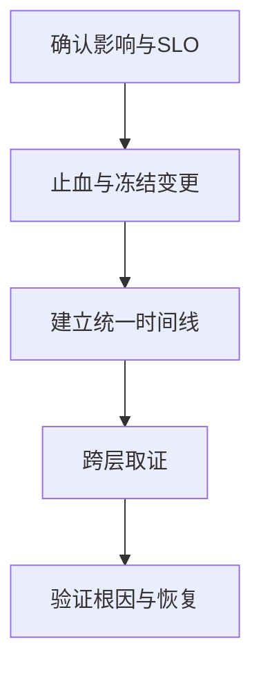

# JVM 生产故障定位 Runbook

线上排障的目标不是尽快执行某条命令，而是在可控风险下恢复业务、保留能证明根因的证据，并防止同一故障再次发生。CPU、GC、线程池和数据库告警经常只是同一条因果链的不同投影。

> 本文中的命令是受控取证示例。先确认实例是否仍承载流量、磁盘空间和操作开销；异常正在扩大时，先按预案摘流量、限流、降级或回滚。

## 1. P8 排障原则：先影响，再现象，再根因

先回答四个问题：谁受影响、从何时开始、最先异常的指标是什么、正在扩大的风险是什么。不要因看到 Full GC、CPU 或队列曲线最高就先假设根因。



一次故障记录至少应包含：请求量、业务成功率、P95/P99、错误率、发布与配置变更、CPU、RSS、JVM 堆、GC、线程池、连接池、依赖 RT 与错误率。所有数据使用同一个时间窗口；否则“先后关系”没有意义。

### 止血与留证如何取舍

| 场景 | 优先动作 | 取证边界 |
| --- | --- | --- |
| 业务成功率持续下降 | 摘异常实例、限流、降级或回滚 | 保存监控窗口、变更记录、Trace 与一至三份间隔线程栈 |
| 单实例异常但集群有余量 | 摘流量后在该实例取证 | Heap Dump、JFR 等高成本动作只在资源充足时执行 |
| 资金、订单、消费位点等状态可能错乱 | 先停止不可逆写入并保留审计线索 | 恢复后必须做对账；指标恢复不等于数据正确 |
| 下游已过载 | 限制重试、隔离非核心路径、削峰 | 不要仅靠扩容上游把压力继续推给下游 |

重启能让表象暂时消失，也会抹掉线程栈、JFR 窗口和内存现场。它是恢复动作，不是根因结论。

## 2. 快速判断问题在哪一层

先从“最早变化的指标”提出假设，再用至少两类独立证据验证。

| 现象 | 首要假设 | 交叉证据 | 常见误判 |
| --- | --- | --- | --- |
| CPU 高、接口慢 | 计算热点、自旋、序列化、锁竞争或高分配 | 热点线程 + JFR/GC 日志 + 流量变化 | 把正常流量增长误判成死循环 |
| CPU 不高、Load 高 | I/O 等待、不可中断睡眠、存储或 CPU 限额 | `vmstat`、`iostat`、容器 throttling、线程状态 | 把 Load 当成 CPU 使用率 |
| RSS 涨、堆稳定 | 直接内存、线程栈、Metaspace、mmap、JNI | NMT + BufferPool + 线程数 + 容器内存 | 只看 `-Xmx` |
| Old GC 后基线持续抬升 | 长生命周期对象持有或无界缓存 | 多次 GC 后基线 + 两份 Heap Dump 引用链 | 把缓存预热当泄漏 |
| 队列和等待线程上涨 | 完成速率低于提交速率，通常受下游拖慢 | 提交/完成速率、执行/排队时长、Trace、依赖指标 | 直接增大线程池 |
| 错误率与下游 RT 同时上升 | 依赖过载、连接池等待或重试放大 | 调用分段耗时、连接池等待、重试次数 | 只看总耗时而忽略等待时间 |

对于微服务，时间线比单个仪表盘更有价值：慢 SQL 先出现，随后连接池等待、线程池排队、网关超时和重试增长，才是可验证的传播链。

## 3. CPU 与 Load：先定位线程，再解释为什么忙

在 Linux 上先确认目标进程，再定位线程；线程栈中的 `nid` 常为十六进制，而系统工具给出的线程 ID 常为十进制。

```bash
PID=$(jps -l | awk '/your.application.Main/{print $1}')
top -H -p "$PID"
printf '%x\n' 12345
jcmd "$PID" Thread.print > /tmp/thread-1.txt
sleep 3
jcmd "$PID" Thread.print > /tmp/thread-2.txt
```

单份线程栈只是采样，连续多份都停在相同调用点才构成强证据。重点区分：

- **RUNNABLE 且稳定热点**：死循环、正则灾难性回溯、JSON/压缩/加密、反序列化、计算密集型代码，或忙等 CAS。
- **频繁 GC**：先看分配速率、暂停与回收后占用；CPU 高可能是高对象创建，不是业务计算。
- **BLOCKED / PARKED 很多**：通常不是 CPU 根因，继续找持锁线程、连接池等待或下游 I/O。
- **CPU 不高但 Load 高**：看 `vmstat 1` 的阻塞任务与 I/O wait、`iostat -xz 1` 的设备利用率/队列，并检查容器 CPU quota 的 throttling。

不要把所有热点线程当成代码缺陷：促销、批任务、全量回放或重试风暴也会让正常代码消耗更多 CPU。必须把线程证据与流量、请求类型和变更时间对齐。

## 4. 慢接口：拆解等待，避免“线程池加大”式修复

一次请求的端到端耗时应可拆为：网关排队、业务线程池排队、数据库/Redis/HTTP 连接池等待、DNS/TCP/TLS、下游处理、序列化和返回。若 Trace 只覆盖业务方法，等待时间会成为无法解释的黑洞。

### 线程池的真正容量方程

稳态下，提交速率大于完成速率时队列必然增长。增加线程只会把并发传导到数据库、Redis、ES、Kafka 消费或外部 LLM；它不是容量凭证。

排查顺序：

1. 明确该池服务的业务、隔离边界和拒绝策略，避免核心请求与批任务混用。
2. 对比任务提交速率、完成速率、排队时长、执行时长与拒绝次数。
3. 抽取运行任务的线程栈，判断是在计算、等锁、等连接还是等远程返回。
4. 联动连接池、下游 RT、超时率和重试次数，确定真正的慢点。
5. 按任务重要性选择限流、隔离、降级、扩容或丢弃，并验证下游预算。

`CallerRunsPolicy` 会把背压传回提交方。它用于受控生产者时有价值；若提交方是 Web 请求线程，可能把排队问题转为接口 P99 上升，必须结合调用链判断。

### 虚拟线程不等于下游无限并发

虚拟线程适合高并发阻塞 I/O，但数据库连接、HTTP 连接、外部模型配额和 ES 搜索线程仍是硬边界。对 SOC AI Agent 的检索、重排和模型调用链，推荐分别设置并发信号量/舱壁、超时预算和幂等重试；不要用创建更多虚拟线程掩盖下游饱和。

相关专题：[并发与虚拟线程](../java/concurrency-virtual-threads.md)、[线程池生产实践](../java/thread-pool-production-guide.md)、[JMM、volatile 与 ThreadLocal](../java/jmm-volatile-threadlocal.md)。

## 5. 内存问题：区分 Heap、RSS 与容器限制

`-Xmx` 只限制 Java 堆。进程 RSS 还包括 Metaspace、Code Cache、线程栈、直接内存、GC 内部结构、内存映射和 JNI/本地库。容器 OOMKill 也可能发生在 Java 堆未满时。

```bash
jcmd "$PID" GC.heap_info
jcmd "$PID" VM.flags
jcmd "$PID" VM.native_memory summary
jcmd "$PID" GC.class_histogram > /tmp/class-histogram.txt
```

`VM.native_memory` 依赖启动时启用 Native Memory Tracking，例如 `-XX:NativeMemoryTracking=summary`。它统计 HotSpot 管理的内部本地内存，不能覆盖所有 JNI 或第三方 native 分配；当 RSS 持续上涨而 NMT 未对应增长时，应转向容器/操作系统和 native 库证据。

| OOM / 内存现象 | 优先方向 | 不能省略的证据 |
| --- | --- | --- |
| `Java heap space` | 大对象、无界集合、缓存、一次加载过多数据 | GC 后基线、Dominator Tree、GC Roots |
| `GC overhead limit exceeded` | 回收耗时高且收益低 | GC 日志、分配率、老年代回收前后占用 |
| `Metaspace` | 动态类、类加载器泄漏或上限 | 类加载器统计、部署/热加载历史 |
| `Direct buffer memory` | NIO/Netty buffer 或上限 | BufferPool、NMT、Netty 指标、RSS |
| `unable to create native thread` | 线程爆炸、栈过大、PID/内存限制 | 线程数、每线程栈、cgroup 限制、系统 ulimit |

Heap Dump 是高价值也高风险的证据。优先在启动参数预置 OOM 自动转储路径和磁盘预算；手工 `GC.heap_dump` 前需先摘流量、确认可用磁盘和 I/O 风险。Heap Dump 中先看支配树与到 GC Roots 的引用链，找到“谁持有对象”，而不是只报一个大 `Map`。

## 6. GC：把“频繁”转成可验证的因果问题

GC 调优不是把堆调大。先回答四件事：对象从哪里来、存活多久、是否成功回收、停顿是否真正影响 SLO。

| 观测 | 高概率原因 | 验证与处理方向 |
| --- | --- | --- |
| Young GC 多、回收后存活少 | 高分配率或年轻代/批处理不匹配 | JFR 分配热点、序列化、日志、批次大小、分页 |
| 晋升快、Old 区上升 | 存活对象多、缓存/批任务、对象生命周期过长 | Survivor/Old 趋势、堆快照、对象年龄与业务窗口 |
| Full GC 后仍高 | 泄漏、无界缓存、类加载器或静态持有 | 多轮回收基线、GC Roots、类加载器统计 |
| 回收后能降但迅速涨回去 | 容量不足或输入量/分配率超设计 | 流量、分配率、批量大小、压测与容量模型 |
| 延迟尖刺但 GC 正常 | 锁、I/O、连接池、CPU throttling、下游慢 | Trace 分段、线程栈、容器与依赖指标 |

对 G1、ZGC 等收集器，日志字段和触发原因不同。结论应来自同一收集器、同一负载下的前后对比，而不是照搬另一收集器的经验参数。

## 7. 下游级联：把 Java 现场接到 MySQL、Redis、Kafka 与 ES

| 下游信号 | 应用侧症状 | 排查落点 | 纠正动作 |
| --- | --- | --- | --- |
| MySQL 慢 SQL / 锁等待 | `getConnection()` 等待、业务池堆积 | 长事务、执行计划、总连接数、连接泄漏 | 缩小事务、修 SQL/索引、隔离与限并发 |
| Redis RT 高但 Slow Log 正常 | 客户端调用慢、连接池等待 | 网络、连接复用、DNS、客户端排队 | 看端到端耗时，不把 Slow Log 当全链路 RT |
| Kafka Lag 上升 | 消费线程忙/阻塞、重试增加 | 分区不均、坏消息、下游吞吐、Rebalance | 限制重试、DLQ、幂等补偿、按分区扩展 |
| ES 写入/搜索变慢 | Bulk 积压、超时、工作线程受阻 | 分片热点、merge、refresh、磁盘、查询模式 | 控制 Bulk 并发与重试，先保护集群而非盲目加 worker |

专题入口：[MySQL 事务、锁与索引](../mysql/transactions-locks-indexes.md)、[Kafka 故障排查](../kafka/09-troubleshooting-runbook.md)、[Redis 面试与排障](../redis/12-interview-troubleshooting.md)、[Elasticsearch 生产故障手册](../elasticsearch/10-production-runbook.md)。

## 8. 生产取证工具：目的、代价与禁区

| 工具 | 适合回答的问题 | 风险控制 |
| --- | --- | --- |
| `jcmd Thread.print` | 哪些线程长期停在哪里、谁持锁 | 连续采样；避免在全量实例高频抓取 |
| JFR / JMC | 分配、锁、CPU、I/O、GC 的关联 | 预设录制策略与保留窗口；先评估额外开销 |
| `jcmd GC.class_histogram` | 哪类对象当前占用异常 | 是快照，不等于引用链或泄漏结论 |
| Heap Dump / MAT | 谁通过何种引用链持有对象 | 需要足够磁盘和 I/O 预算；优先摘流量后执行 |
| NMT | HotSpot 内部 native 内存类别 | 必须启动前开启；不覆盖所有 native 分配 |
| Arthas | 运行期线程、类、方法热点观察 | 对高频方法的 Trace/Watch 必须限范围、限时、限实例 |

不要在线上将 `System.gc()`、`jmap -dump:live`、全量类直方图或不受控 Arthas 追踪当成“零成本检查”。先定义要验证的假设，再选最小侵入手段。

## 9. 一条 P8 级面试答案

> “我处理线上 JVM 类问题时，先按影响和时间线做分级：确认业务成功率、P99、异常实例占比、最近发布和依赖告警，必要时先摘实例、限流或回滚。随后把 CPU、RSS/堆、GC、线程池和连接池与 Trace 放进同一时间窗口，判断最早异常点。CPU 高就用连续线程栈和 JFR 区分计算热点、锁竞争和高分配；RSS 高但堆稳定就查直接内存、线程栈、Metaspace、NMT 与容器限制；线程池排队则比较提交/完成速率，并向下游连接池、慢 SQL 或远程调用追根因。修复后我会在相同数据和流量模型下对比用户指标、依赖指标与 GC，并对订单、消费位点等关键数据做对账，最后把监控阈值、容量预算和回归场景固化。”

### 高频追问

**Q：为什么不先把线程池扩大？**

线程池的队列增长只说明进入速率大于完成速率。若任务堵在数据库连接、Redis、ES 或外部模型调用上，增线程会把并发进一步压向已经慢的下游，常导致超时和重试放大。先定位服务时间与等待时间，再按下游容量配置隔离和并发上限。

**Q：RSS 增长但 Heap Dump 没发现问题，下一步是什么？**

先核对容器的内存口径、线程数、每线程栈、Metaspace、直接内存、mmap 和 native 库。若启动时开启 NMT，就对比其 summary/diff；NMT 无变化不代表 native 内存正常，因为它不覆盖所有 JNI/第三方分配。继续用操作系统和库级指标定位，必要时在演练环境做 native 分析。

**Q：如何证明修复有效？**

不是看告警消失，而是在相同或更接近生产的流量、数据量、缓存状态和机器限制下，对比修复前后的成功率、P99、CPU、GC、排队时长、依赖 RT 与错误率；涉及异步或状态写入时还要对账。临时降级解除后仍稳定，才算闭环。

## 10. 复盘交付物

复盘必须可执行：时间线、影响范围、触发条件、根因证据、止血副作用、数据对账结果、缺失的监控/预案/测试，以及每项改进的负责人和完成时间。把“加强检查”改为可验证的机制，例如：连接池等待阈值、任务排队时长告警、重试预算、OOM Dump 磁盘巡检、发布后关键路径对比与故障演练。

## 参考资料

- [JavaGuide：Java 后端线上问题排查](https://javaguide.cn/java/jvm/jvm-in-action.html)（问题清单与排查框架参考；本文为原创整理与扩展）
- [Oracle JDK 21：诊断工具与 Native Memory Tracking](https://docs.oracle.com/en/java/javase/21/troubleshoot/diagnostic-tools.html)
- [Oracle JDK 21：HotSpot 诊断选项与 OOM Heap Dump](https://docs.oracle.com/en/java/javase/21/troubleshoot/command-line-options1.html)
- [Oracle JDK 21：进程卡死与循环排查](https://docs.oracle.com/en/java/javase/21/troubleshoot/troubleshoot-process-hangs-loops.html)
