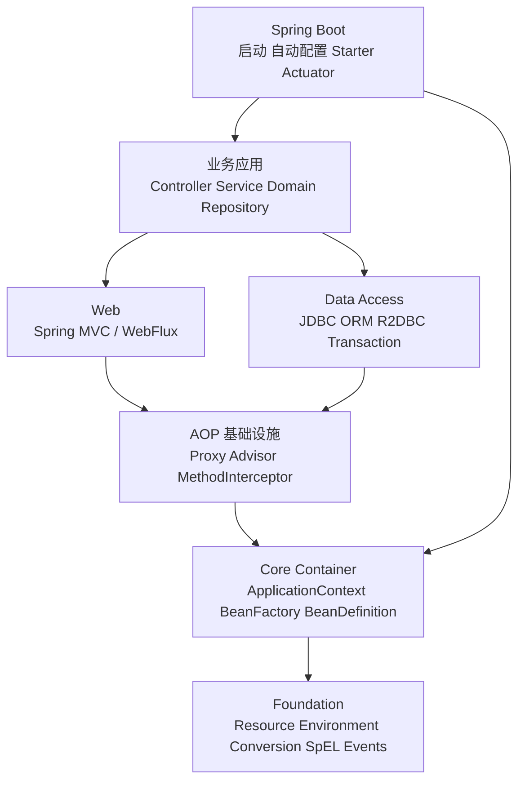

# Spring 核心架构

## 一句话回答

Spring Framework 的核心是 IoC 容器。容器以 `BeanDefinition` 保存对象元数据，由 `BeanFactory` 创建和装配 Bean；`ApplicationContext` 在此基础上提供事件、资源、环境与生命周期能力；AOP 再通过代理和拦截器链实现事务、缓存、异步等横切功能，Web 与数据访问模块建立在这些基础设施之上。

## 总体分层



Spring Framework 与 Spring Boot 不能混为一谈：Framework 提供容器、AOP、事务和 Web 等基础能力；Boot 负责应用启动、约定配置、条件装配、Starter 依赖组织和生产可运维入口。

## 四个必须讲清的核心对象

### BeanDefinition

它是 Bean 的元数据模型，描述类、作用域、构造参数、属性依赖、初始化方法、销毁方法、懒加载和自动装配候选资格。容器通常先注册定义，再按需创建实例。

### BeanFactory

它是 IoC 容器的基础契约，负责 Bean 注册、查找、创建、依赖解析、作用域和生命周期。常见核心实现是 `DefaultListableBeanFactory`。

### ApplicationContext

它组合并增强 `BeanFactory`，提供资源加载、国际化、事件发布、Environment、后置处理器自动发现以及容器刷新和关闭管理。业务应用通常直接使用它。

### BeanPostProcessor

它在 Bean 初始化前后介入，能够返回原对象或包装对象。依赖注入注解、生命周期注解和自动代理创建都依赖不同的后置处理器。

## 容器启动主线

```text
创建 ApplicationContext
  -> 准备 Environment
  -> 解析配置并注册 BeanDefinition
  -> refresh()
  -> 执行 BeanFactoryPostProcessor
  -> 注册 BeanPostProcessor
  -> 初始化事件、国际化等基础设施
  -> 创建非懒加载单例
  -> 发布刷新完成事件
```

面试中要强调：容器刷新与单个 Bean 创建是两条相关但不同的主线。`refresh()` 负责搭建整个工厂和基础设施；`getBean()`/`doCreateBean()` 负责某个 Bean 的实例化、属性填充和初始化。

## 高频面试题

### Q1. Spring 的核心到底是什么？

**30 秒回答：**核心是 IoC 容器，AOP 是关键增强机制。IoC 管理对象和依赖，AOP 把事务、缓存、异步等横切逻辑织入 Bean 的方法调用。

**追问边界：**Spring MVC、Spring Data、Spring Security 和 Spring Boot 都不是 IoC 的替代物，而是使用或扩展容器基础设施。

### Q2. BeanFactory 和 ApplicationContext 有什么区别？

**标准回答：**前者是基础容器契约；后者是完整应用上下文，增加事件、资源、国际化、环境、生命周期和后置处理器编排。不要只回答“一个懒加载、一个饿加载”，因为初始化策略可配置，且差异远不止创建时机。

### Q3. Spring 为什么容易扩展？

**标准回答：**它把不同阶段暴露为清晰扩展点：定义阶段有 `BeanDefinitionRegistryPostProcessor` 和 `BeanFactoryPostProcessor`，实例阶段有 `InstantiationAwareBeanPostProcessor` 与 `BeanPostProcessor`，方法调用阶段有 Advisor 和 MethodInterceptor，容器阶段有事件与生命周期接口。

### Q4. Spring 单例等于 JVM 单例吗？

**标准回答：**不等于。默认 singleton 是“每个容器、每个 Bean 名称一个共享实例”，多个 ApplicationContext 可以各自拥有实例，也不代表对象线程安全。

### Q5. Spring 如何把注解变成功能？

**标准回答：**注解只是元数据。容器通过配置类解析器、注册器、后置处理器或 Advisor 读取元数据并注册基础设施，真正的行为通常发生在 Bean 创建或代理调用阶段。

## 两分钟口述模板

> Spring 采用模块化架构，底层是 Resource、Environment、类型转换和事件等基础能力，核心是以 BeanDefinition、BeanFactory 和 ApplicationContext 为中心的 IoC 容器。启动时先解析配置并注册 BeanDefinition，随后在 refresh 流程中执行工厂后置处理器、注册 Bean 后置处理器，并创建非懒加载单例。单个 Bean 又会经过实例化、属性填充、Aware 回调、初始化和后置处理。AOP 自动代理创建器会在后置处理阶段把符合 Advisor 的 Bean 包装成代理，事务、缓存和异步等功能再通过拦截器链执行。MVC、数据访问等模块建立在这些机制之上，Boot 则负责启动和自动配置。生产上必须关注代理边界、事务边界、线程上下文和资源池，而不能只背注解。

## 易错点

- 把 IoC 解释成“少写 new”，没有说控制权、依赖解析和生命周期。
- 把 BeanDefinition 当成 Bean 实例。
- 认为所有 Bean 都在启动时立即创建。
- 认为加了注解就一定生效，忽略代理、线程和容器管理边界。
- 把 Spring Boot 自动配置误认为运行期动态扫描所有依赖。
