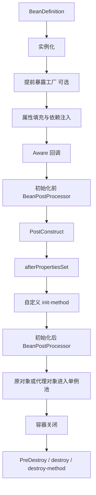

# Bean 生命周期与扩展点

## 容器刷新与 Bean 创建要分开回答

`AbstractApplicationContext.refresh()` 是容器级模板方法；`AbstractAutowireCapableBeanFactory.doCreateBean()` 是单 Bean 创建主流程。资深回答要明确两个层级，避免把所有步骤混成一条链。

## refresh 核心阶段

```text
prepareRefresh
obtainFreshBeanFactory
prepareBeanFactory
postProcessBeanFactory
invokeBeanFactoryPostProcessors
registerBeanPostProcessors
initMessageSource
initApplicationEventMulticaster
onRefresh
registerListeners
finishBeanFactoryInitialization
finishRefresh
```

关键顺序是先允许修改 BeanDefinition，再注册处理 Bean 实例的后置处理器，最后创建剩余非懒加载单例。

## 单个 Bean 生命周期



严格源码顺序还涉及 `MergedBeanDefinitionPostProcessor`、`InstantiationAwareBeanPostProcessor`、提前引用和销毁注册。面试无需一次背完，但要能按实例化、填充、初始化、增强、销毁五段解释。

## 定义阶段扩展点

### BeanDefinitionRegistryPostProcessor

可以在普通 BeanFactory 后置处理器执行前继续注册 BeanDefinition。配置类解析器就是重要实现之一。

### BeanFactoryPostProcessor

容器实例化普通 Bean 前修改 BeanDefinition 或工厂配置。它处理的是定义，不应在这里过早调用普通 `getBean()`，否则可能绕开完整后置处理链。

## 实例阶段扩展点

### InstantiationAwareBeanPostProcessor

可以在实例化前后和属性填充阶段介入，自动注入处理器依赖它查找注入点。

### BeanPostProcessor

在初始化前后处理 Bean。自动代理创建器通常在初始化后判断 Advisor 并返回代理。

### SmartInstantiationAwareBeanPostProcessor

提供候选构造器预测、类型预测和提前引用能力，是循环依赖与 AOP 代理一致性的重要接口。

## 初始化与销毁

初始化回调常见顺序：`@PostConstruct`、`InitializingBean.afterPropertiesSet()`、自定义 init-method。销毁回调包括 `@PreDestroy`、`DisposableBean.destroy()` 和自定义 destroy-method。通常优先使用标准注解或外部配置，避免业务类强耦合 Spring 接口。

prototype Bean 创建后容器一般不负责完整销毁；使用方必须管理外部资源。singleton 的销毁在上下文关闭时统一执行。

## 高频面试题

### Q1. BeanPostProcessor 为什么是 Spring 的关键扩展点？

它统一拦截容器创建的 Bean，并允许替换返回对象，因此依赖注入、生命周期注解、校验和代理都能以基础设施形式组合，而无需侵入业务类。

### Q2. 初始化后返回代理，单例池里保存谁？

正常情况下对外暴露的是后置处理器返回的最终对象，可能是代理。依赖注入和 `getBean()` 应尽量获得同一个最终引用；循环依赖时需要提前代理引用来保持一致。

### Q3. 为什么 BeanPostProcessor 本身要早于普通单例创建？

否则先创建的 Bean 无法经过完整处理链，可能缺失注入、生命周期或代理增强。因此 refresh 先注册后置处理器，再完成非懒加载单例实例化。

### Q4. `@PostConstruct` 中调用事务方法有效吗？

不能默认认为有效。初始化阶段代理可能尚未成为外部调用入口，自调用也会绕过代理。需要事务的启动逻辑应由独立 Bean、应用就绪事件或明确编排组件执行，并保证失败处理与幂等。

## 排障提示

- Bean 初始化卡住：线程转储定位哪个初始化方法、网络调用或锁阻塞。
- Bean 未代理：确认是否由容器管理、是否匹配 pointcut、是否过早实例化。
- 关闭不释放：检查自定义线程池、客户端和资源是否注册销毁回调。
- 后置处理器顺序异常：检查 `PriorityOrdered`、`Ordered` 和无序组件，不要把顺序当成偶然扫描结果。
