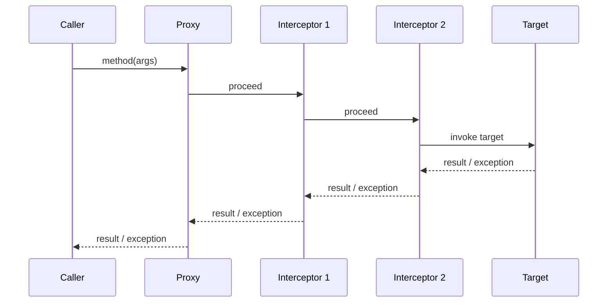

# AOP、代理与拦截器链

## AOP 解决什么问题

AOP 把事务、缓存、异步、权限、日志和监控等横切逻辑从业务方法中分离。Spring AOP 主要是运行期代理：调用必须先进入代理，代理根据 Advisor 组装拦截器链，再执行目标方法。



## 核心概念

- **Join point**：可被增强的执行点，Spring AOP 主要关注方法执行。
- **Pointcut**：哪些方法匹配。
- **Advice**：匹配后执行什么逻辑。
- **Advisor**：Pointcut 与 Advice 的组合。
- **MethodInterceptor**：围绕方法调用执行并控制 `proceed()`。
- **TargetSource**：代理如何获得目标对象。

## 自动代理创建

自动代理创建器是 BeanPostProcessor。它在 Bean 创建后查找可用 Advisor，判断目标类是否匹配，创建代理配置，选择代理工厂并返回代理对象。后续调用由代理构建并执行拦截器链。

## JDK 动态代理与 CGLIB

JDK 动态代理基于接口生成代理，调用方应面向接口类型。CGLIB 类代理通过生成目标类子类覆盖可增强方法；`final` 类不能被继承，`final` 方法不能被覆盖，`private` 方法也不是可覆盖连接点。

选择哪种代理不是资深回答重点，重点是调用是否经过代理、方法是否可增强，以及类型转换是否依赖具体实现类。

## 自调用为什么失效

```java
public void outer() {
    this.inner();
}

@Transactional
public void inner() {
}
```

外部进入 `outer()` 后，`this` 是目标对象本身，`inner()` 不会再次经过代理，因此事务拦截器没有执行。缓存、异步、重试等基于代理的注解也有同类边界。

优先方案是按业务边界拆到另一个 Bean，通过外部调用进入代理。暴露当前代理或自注入会增加耦合，只适合作为受控兼容方案。

## 多切面顺序

多个拦截器的顺序会影响语义，例如事务包在重试外还是重试包在事务外，决定每次重试是否新开事务；缓存与事务的顺序影响缓存写入是否可能早于提交。使用 `Ordered` 明确顺序，并通过集成测试验证实际链路，不能只看注解排列。

## 高频面试题

### Q1. Spring AOP 和 AspectJ 有什么区别？

Spring AOP 主要使用容器 Bean 的运行期代理，连接点集中在方法执行；AspectJ 可以在编译期或加载期织入，支持更丰富连接点。多数服务端横切能力用 Spring AOP 足够。

### Q2. `private` 方法加事务为什么不可靠？

代理无法以常规外部可拦截方法调用进入它，而且通常由同类内部调用。事务边界应放在可由代理调用的业务入口，不要把注解当作字节码魔法。

### Q3. 如何确认一个 Bean 是否被代理？

检查运行期类型、AOP 工具判断、容器日志和 Advisor 列表；更重要的是通过行为测试确认拦截器是否执行。不要仅看到类名含代理后缀就认为目标方法一定匹配。

### Q4. 一个 Bean 能否同时有事务、缓存和异步？

可以匹配多个 Advisor，但必须明确调用入口、拦截器顺序与线程切换。异步切换线程后外层线程绑定事务不会自动传递，缓存写入时机也要与事务提交协调。

## 生产排障清单

1. 对象是否由当前 Spring 容器创建。
2. 调用方拿到的是代理还是手工 new 的目标对象。
3. 方法是否匹配 pointcut，是否可见、可覆盖。
4. 是否发生自调用。
5. 是否有多个上下文或重复 Bean。
6. Advisor 顺序是否符合语义。
7. 是否在线程切换后误以为上下文仍存在。
