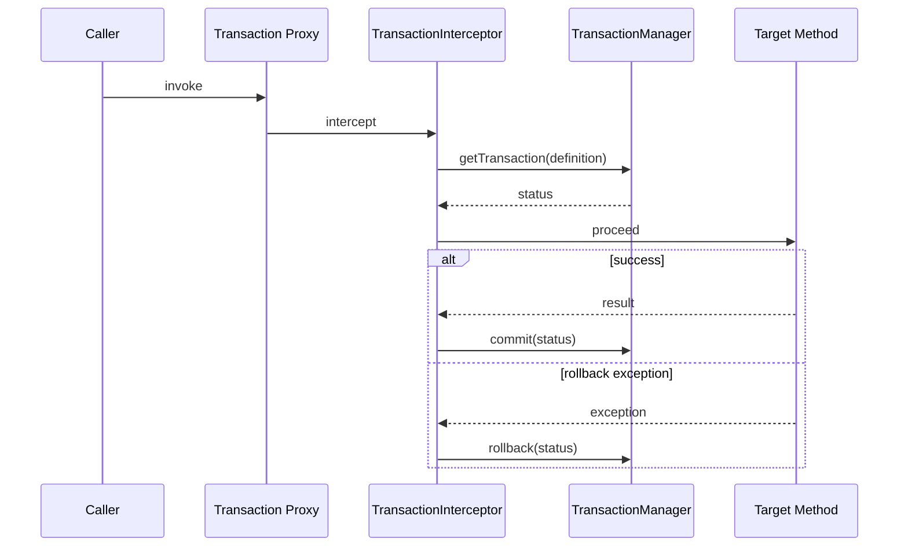

# Spring 声明式事务原理

## 一句话回答

`@Transactional` 是事务元数据，不是事务本身。Spring 通过 AOP 代理让 `TransactionInterceptor` 在方法前解析事务属性并调用 `PlatformTransactionManager` 开启或加入事务，方法正常返回时提交，满足回滚规则的异常抛出时回滚。

## 调用链



核心组件包括 `TransactionAttributeSource`、`TransactionInterceptor`、`TransactionAspectSupport`、`PlatformTransactionManager`、`TransactionDefinition` 和 `TransactionStatus`。

## 传播行为

- **REQUIRED**：有事务就加入，没有就新建，是常用默认值。
- **REQUIRES_NEW**：挂起外层事务，新开物理事务；通常额外占用连接。
- **NESTED**：在支持时使用保存点，仍属于同一物理事务语境，与 REQUIRES_NEW 不同。
- **SUPPORTS**：有则加入，无则非事务执行。
- **MANDATORY**：必须已有事务，否则失败。
- **NOT_SUPPORTED**：挂起事务，以非事务方式执行。
- **NEVER**：存在事务则失败。

面试不应只背枚举，要说明物理事务、逻辑作用域、连接占用和内外层回滚关系。

## 回滚规则

默认通常对未检查异常和 Error 回滚；受检异常需要按业务语义配置。最常见失效不是“数据库不支持”，而是异常被捕获后未重新抛出，代理看到方法正常返回，于是提交。

事务已经被内层标记 rollback-only 后，外层即使捕获异常并继续，也可能在提交时得到意外回滚。不要用 catch 掩盖事务状态。

## 高频失效场景

1. 同类自调用绕过代理。
2. 对象不是容器 Bean，或调用的是手工 new 的实例。
3. 方法不可被代理增强。
4. 异常被吞掉或不符合回滚规则。
5. 在线程切换后误以为继承原事务。
6. 使用了错误的事务管理器或数据源。
7. 事务边界过大，内部远程调用超时导致长时间占用连接。
8. 只读、隔离级别等提示与底层资源能力不匹配。

## REQUIRES_NEW 的风险

外层事务持有一个连接，内层独立事务还需要另一个连接。高并发时可能造成连接池耗尽；内层已经提交而外层回滚，还会形成业务事实不一致。仅用于真正独立、允许先提交的操作，并控制并发和连接池预算。

## 异步与事务

传统资源事务上下文通常绑定当前线程。`@Async` 切换到执行器线程后，不会自动继承调用线程事务。正确做法是让异步任务拥有自己的短事务，或先在本地事务内写 Outbox，再由异步发布器可靠处理。

虚拟线程降低线程承载成本，但不会自动扩大数据库连接池，也不会改变线程绑定事务的基本边界。仍需要并发闸门、超时和资源预算。

## DB 与外部系统一致性

数据库事务无法天然原子覆盖 Kafka、Elasticsearch、HTTP 工具调用等外部副作用。常见模式：

```text
本地事务：业务数据 + Outbox
  -> 提交
发布器读取 Outbox
  -> 发送消息
  -> 标记发布结果
消费者按 event_id 幂等
```

发送成功但状态更新失败会重复发送，因此“至少一次 + 下游幂等”是正常设计，而不是异常补丁。对未知结果要查询、对账或人工处理，不能盲目重试高危副作用。

## 高频面试题

### Q1. 为什么 `@Transactional` 在同类调用中失效？

因为 `this.method()` 没有重新进入代理，`TransactionInterceptor` 未执行。优先拆分事务服务，让调用跨 Bean 边界。

### Q2. REQUIRED 内层失败，外层捕获后能提交吗？

不应默认能。内层与外层加入同一物理事务时，内层可能把事务标记为 rollback-only，最终外层提交会失败。要重新审视异常契约，而不是简单 catch。

### Q3. NESTED 和 REQUIRES_NEW 的区别？

NESTED 通常利用同一物理事务的保存点，外层回滚仍会回滚整体；REQUIRES_NEW 是独立事务，内层提交不会随外层回滚，但需要独立资源。

### Q4. 事务方法中发送 Kafka 消息有什么问题？

DB 提交与消息发送不是同一原子动作。先发可能出现消息已见但 DB 回滚，后发可能出现 DB 已提交但消息失败。使用 Outbox 或适当事务消息，并要求端到端幂等和补偿。

## 项目化回答模板

> 我先界定本地事务只覆盖同一事务管理器管理的资源。订单状态变更和 Outbox 在一个 MySQL 事务中提交，发布器异步发送 Kafka；event_id 做稳定幂等键，消费者用唯一约束和状态机吸收重复。远程调用不放在长事务内，超时结果进入 UNKNOWN 后查询或对账。事务指标关注连接池等待、事务时长、回滚率、死锁和 Outbox 积压。
