# Spring MVC 请求链路

## 总体流程

Spring MVC 使用前端控制器模式，`DispatcherServlet` 统一接收请求，再委托可插拔组件完成处理器查找、方法调用、返回值处理、视图渲染和异常解析。

```mermaid
flowchart LR
    A[HTTP Request] --> B[Filter Chain]
    B --> C[DispatcherServlet]
    C --> D[HandlerMapping]
    D --> E[HandlerExecutionChain]
    E --> F[HandlerAdapter]
    F --> G[ArgumentResolver]
    G --> H[Controller]
    H --> I[ReturnValueHandler]
    I --> J[HttpMessageConverter / ViewResolver]
    J --> K[HTTP Response]
    H -. exception .-> L[HandlerExceptionResolver]
    L --> I
```



## 核心组件

- `HandlerMapping`：根据请求找到 Handler，并组合拦截器。
- `HandlerAdapter`：适配不同 Handler 类型；注解控制器通常由 `RequestMappingHandlerAdapter` 执行。
- `HandlerMethodArgumentResolver`：解析路径、查询、请求体、认证主体等参数。
- `HandlerMethodReturnValueHandler`：处理返回对象、ResponseEntity、异步类型等。
- `HttpMessageConverter`：在 Java 对象与请求/响应媒体类型间转换。
- `ViewResolver`：解析服务端视图。
- `HandlerExceptionResolver`：把异常转换成响应或视图。

## DispatcherServlet 主流程

```text
service
  -> FrameworkServlet.processRequest
  -> doService
  -> doDispatch
     -> getHandler
     -> getHandlerAdapter
     -> applyPreHandle
     -> handlerAdapter.handle
     -> applyPostHandle
     -> processDispatchResult
        -> processHandlerException
        -> render
     -> triggerAfterCompletion
```

## 参数解析与消息转换

`@RequestBody` 通常通过消息转换器反序列化；`@ModelAttribute` 更偏向数据绑定。校验、绑定错误和转换失败发生在 Controller 方法真正执行前，统一异常设计必须覆盖这些阶段。

生产中应显式控制请求体大小、字段校验、未知字段策略、时间格式和错误响应，避免把反序列化异常统一映射成 500。

## Filter、Interceptor 与 AOP

- **Filter**：Servlet 级别，能处理最外层请求/响应、编码、安全头和包装流。
- **HandlerInterceptor**：MVC Handler 级别，知道处理器信息，适合鉴权、审计和请求上下文。
- **AOP**：Bean 方法级别，适合服务横切逻辑。

三者作用层次不同。异常发生在进入 DispatcherServlet 之前时，MVC 的异常处理器未必能接住。

## 异步请求

MVC 异步能力可让 Servlet 容器线程提前释放，由其他执行器继续工作，再触发异步派发。线程切换后 MDC、SecurityContext、Locale 和事务上下文不能凭想象自动存在，需要明确的上下文传播策略。

对于长时间 LLM 或外部工具调用，除了线程模型，还要设置入口超时、下游超时、取消语义、并发闸门和结果幂等。线程释放不等于下游容量无限。

## 高频面试题

### Q1. DispatcherServlet 为什么需要 HandlerAdapter？

它隔离“如何找到处理器”和“如何执行处理器”。DispatcherServlet 无需了解每种 Controller 形态，通过适配器扩展执行模型。

### Q2. `@ControllerAdvice` 如何生效？

框架发现全局建议并构建异常处理器、绑定器或模型增强元数据。异常发生后由 `HandlerExceptionResolver` 链匹配具体处理方法。Filter 中抛出的异常不一定进入同一路径。

### Q3. JSON 序列化发生在哪里？

Controller 返回值先由 ReturnValueHandler 判断处理方式，`@ResponseBody` 或 RestController 场景再由匹配媒体类型的 HttpMessageConverter 写入响应。

### Q4. Interceptor 的 afterCompletion 一定执行吗？

只有请求成功进入相应拦截链阶段后才有对应回调，异步请求还存在并发处理回调和再次派发。资源清理不能只依赖错误假设，应针对实际生命周期测试。

## 生产排障

- 404：检查映射是否注册、路径条件、Context Path 和网关重写。
- 400：检查参数绑定、消息转换、校验和请求媒体类型。
- 415/406：检查 Content-Type、Accept 与转换器能力。
- 响应慢：区分容器排队、Controller、下游、序列化和客户端写出。
- 大对象内存抖动：限制请求/响应、流式处理、避免日志打印完整载荷。
