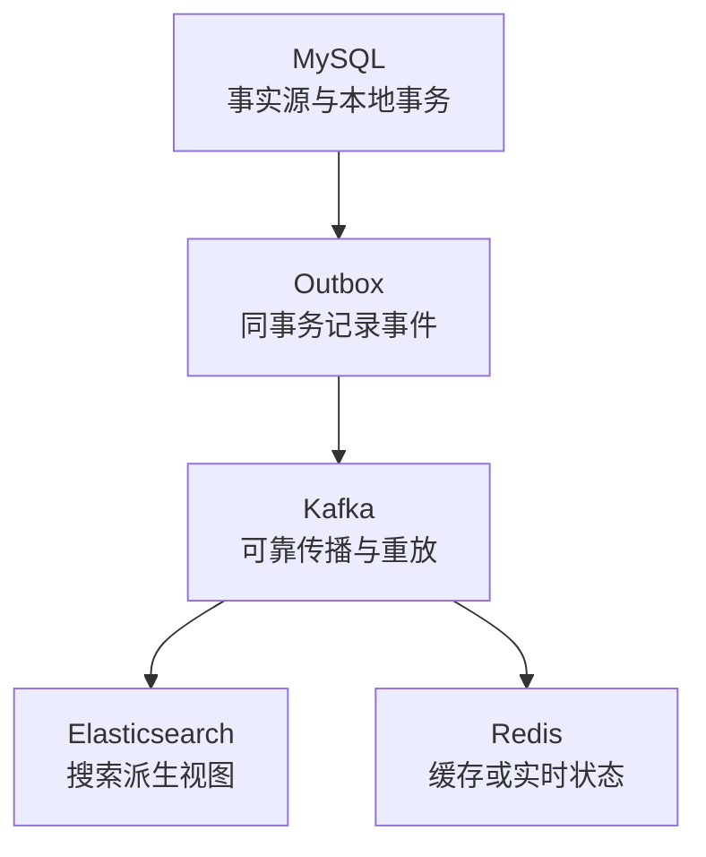

# 四大存储事务机制对比

> [!IMPORTANT]
> 这四种机制解决的不是同一个问题。MySQL 保护数据库事务，Redis 保证一段命令不被其他客户端插入，Kafka 保护日志写入和消费位点的原子可见性，Elasticsearch 只承诺单文档写入原子。所谓“由强到弱”只能表示事务能力完整度，不能代表性能或产品优劣。

## 先看结论

| 存储 | 原子边界 | 冲突控制 | 失败后的真实语义 | 读可见性 | 不提供什么 |
| --- | --- | --- | --- | --- | --- |
| MySQL InnoDB | 一个本地数据库事务中的多行、多表操作 | MVCC、行锁、间隙锁与死锁检测 | 未提交事务可回滚；崩溃后由 redo/undo 等恢复机制保证一致性 | 4 种隔离级别，InnoDB 默认 `REPEATABLE READ` | 默认不覆盖 Kafka、Redis、ES 或 HTTP |
| Redis | `MULTI/EXEC` 队列，或一段 Lua/Function 执行 | `WATCH` 乐观冲突检测；执行阶段不穿插其他客户端命令 | 入队错误可使 `EXEC` 拒绝执行；运行时错误不会撤销已经成功的命令或脚本写入 | 命令串行可见，不是数据库快照隔离 | 不提供回滚、隔离级别和跨节点 ACID |
| Kafka | 同一事务内跨 Topic/Partition 的记录，以及 consume-transform-produce 的消费位点 | PID、producer epoch、分区序号与事务协调器 | Abort 是逻辑不可见，不是物理删日志；`read_committed` 跳过中止事务记录 | 消费者通过 `isolation.level=read_committed` 只读已提交数据 | Exactly-once 不自动覆盖外部数据库和 HTTP 副作用 |
| Elasticsearch | 单文档 `index/update/delete` | `_seq_no` + `_primary_term` 乐观并发控制 | 单文档操作成功或失败；`bulk` 每项独立，可能部分成功 | 写入持久化与 refresh 后可被搜索是两件事 | 不提供多文档事务和批量回滚 |

一句话记忆：**MySQL 是可回滚的数据库事务，Kafka 是可提交或中止的日志事务，Redis 是不中断的命令执行，Elasticsearch 是单文档原子写。**

这条光谱只比较“事务能力完整度”。实际选型要按事实源、吞吐、查询模型、延迟和故障恢复目标分别判断。

## MySQL：完整的本地 ACID 事务

InnoDB 以事务为边界组合多个读写操作：

- **undo log** 保存旧版本，服务于事务回滚和一致性读；**redo log** 采用 WAL 思路记录页修改，用于崩溃恢复。
- 普通一致性读通常通过 MVCC 读取快照；锁定读和写操作读取最新状态，并使用记录锁、间隙锁或 next-key lock 控制并发。
- 支持 `READ UNCOMMITTED`、`READ COMMITTED`、`REPEATABLE READ` 和 `SERIALIZABLE`，InnoDB 默认是 `REPEATABLE READ`。
- XA 可以把支持 XA 的参与者纳入两阶段提交，但会引入协调、阻塞和恢复成本，不应把它当作所有跨系统一致性的默认答案。

事务提交成功也不等于业务已经通知下游。订单写 MySQL 后还要发 Kafka 时，优先评估 [Outbox / Inbox](../finance-payment-ddd/08-events-outbox-inbox.md)，不要直接假设一个本地事务能覆盖两个系统。

详见：[InnoDB 写入、MVCC 与事务](../mysql/innodb-write-mvcc-transactions.md)。

## Redis：原子执行不等于可回滚事务

### `MULTI/EXEC`

`MULTI` 之后的命令先进入队列，`EXEC` 时按顺序执行，执行期间不会插入其他客户端命令。但失败必须分两类：

1. **入队阶段错误**：例如命令参数数量错误，服务端会标记事务，`EXEC` 拒绝执行整个队列。
2. **执行阶段错误**：例如对错误类型的键执行命令，出错命令失败，其他命令仍会继续；此前成功的写入不会回滚。

### `WATCH` 与 Lua/Functions

- `WATCH` 是乐观并发控制：被监视的键在 `EXEC` 前发生变化，事务不会执行，客户端需要重新读取并重试。
- Lua 脚本和 Redis Functions 在执行时不会与其他命令交错，适合封装读改写逻辑。
- 脚本的“原子”表示不被插入，并不表示数据库式回滚。脚本报错前已完成的写入不会自动撤销，因此要先校验参数和类型，再执行修改。

这也是 Redis 不提供回滚的设计取舍：保持模型简单且执行高效，把补偿、重试和幂等留给调用方。

详见：[Redis 事务、Lua 与 Functions](../redis/09-transactions-lua-functions.md)。

## Kafka：日志事务的原子可见性

Kafka 的幂等 Producer 与事务是两层能力：

- 幂等 Producer 使用 PID、producer epoch 和每分区序号抑制重试产生的重复记录；它解决单个生产会话内的重复写，不等于跨分区事务。
- 事务 Producer 可把多个 Topic/Partition 的记录，以及消费后提交的 offsets，放入同一事务边界。
- Transaction Coordinator 管理事务状态，并通过事务日志和 Partition 上的 Commit/Abort marker 完成可见性判定。
- `read_committed` 消费者只返回已提交事务的记录。被中止的记录仍可能物理存在于日志中，后续由保留或压缩机制处理，所以这里的 Abort 不是 MySQL 式物理回滚。

Kafka 的 exactly-once 最适合 consume-transform-produce 链路。若消费者还写 MySQL、Redis、Elasticsearch 或调用 HTTP，外部副作用仍需幂等键、Outbox/Inbox、状态机或对账闭环。

详见：[Kafka Exactly-Once](../kafka/06-delivery-semantics-exactly-once.md)。

## Elasticsearch：单文档原子与乐观并发

Elasticsearch 由主分片协调单文档写入：

- 单次 `index`、`update` 或 `delete` 以一个文档为原子边界。
- `_seq_no` 标识分片上操作的顺序，`_primary_term` 区分主分片任期；写请求带 `if_seq_no` 和 `if_primary_term` 可避免旧版本覆盖新版本。
- `_bulk` 只是减少网络往返和提高吞吐，每个 item 独立返回结果，不能把批量请求视为一个事务。
- translog 影响崩溃恢复与写入持久性；refresh 决定新数据何时能被搜索。写请求成功不等于搜索立即可见，二者不要混为一谈。

多文档更新若部分失败，调用方要记录成功项、按 item 重试，并用业务幂等键或版本号防止重复覆盖。

详见：[Elasticsearch 写入链路](../elasticsearch/04-write-path.md)与[重建索引一致性](../elasticsearch/12-reindex-consistency.md)。

## 四种机制如何组合

典型业务系统不是四选一，而是给每个系统分配清晰职责：

推荐边界：

1. MySQL 保存不可丢失的业务事实和状态机，在本地事务中同时写 Outbox。
2. 发布器把 Outbox 事件投递到 Kafka，依靠事件 ID 实现幂等重试。
3. Elasticsearch 和 Redis 作为派生数据消费者，允许通过 Kafka 重放或 MySQL 对账修复。
4. 端到端一致性靠幂等、可重放、补偿与对账闭环，而不是声称存在一个覆盖全部组件的“大事务”。

## 面试中的 90 秒回答

> MySQL InnoDB 提供真正的本地 ACID 事务，依靠 undo、redo、MVCC 和锁实现回滚、恢复与隔离。Redis 的 `MULTI/EXEC`、Lua 和 Functions 主要保证命令连续执行，不提供数据库式回滚；`WATCH` 用于乐观冲突检测。Kafka 的事务解决跨分区消息和消费位点的原子可见性，Abort 记录仍在日志里，但 `read_committed` 不会返回，中间件外部副作用不在 exactly-once 边界内。Elasticsearch 只保证单文档写原子，通过 `_seq_no` 和 `_primary_term` 做乐观并发控制，`bulk` 可能部分成功，translog 持久化与 refresh 搜索可见性也要区分。实际架构通常用 MySQL 做事实源，通过 Outbox 接 Kafka，再让 Redis 和 Elasticsearch 成为可重建的派生视图。

## 常见追问与失分点

| 追问 | 回答要点 |
| --- | --- |
| Redis Lua 出错会全部回滚吗？ | 不会。脚本不被其他命令穿插，但报错前已执行的写入不会撤销。 |
| Kafka Abort 会删除已经写入的消息吗？ | 不会立即物理删除；事务标记让 `read_committed` 消费者跳过中止记录。 |
| Kafka exactly-once 能保证数据库只写一次吗？ | 不能自动保证。外部数据库写入需要幂等、Outbox/Inbox 或其他一致性协议。 |
| Elasticsearch `bulk` 是事务吗？ | 不是。每个 item 独立成功或失败，必须逐项检查响应。 |
| ES 写成功为什么立刻搜不到？ | 持久化和搜索可见性是不同阶段；通常要等 refresh。 |
| XA 为什么不是跨系统一致性的万能方案？ | 参与者支持、阻塞、故障恢复和运维成本都会限制适用范围。 |

## 参考资料

- MySQL：[InnoDB Transaction Model](https://dev.mysql.com/doc/refman/8.4/en/innodb-transaction-model.html)、[Transaction Isolation Levels](https://dev.mysql.com/doc/refman/8.4/en/innodb-transaction-isolation-levels.html)
- Redis：[Transactions](https://redis.io/docs/latest/develop/using-commands/transactions/)
- Kafka：[Design — Transactions](https://kafka.apache.org/40/design/design/)
- Elasticsearch：[Optimistic concurrency control](https://www.elastic.co/docs/reference/elasticsearch/rest-apis/optimistic-concurrency-control)、[Bulk API](https://www.elastic.co/docs/api/doc/elasticsearch/operation/operation-bulk)、[Translog](https://www.elastic.co/docs/reference/elasticsearch/index-settings/translog)
